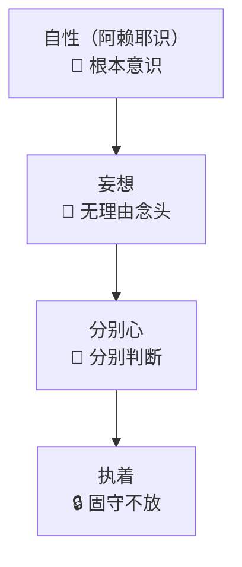

> [!abstract] 概述
> 本文阐述心识从自性（阿赖耶识）到妄想、分别心、执着的发展过程，以及从凡夫到成佛的逆向修行次第。

# 一、心识发展过程

## 从上而下的逻辑线

> [!info] 心识发展顺序
> 心识从自性（阿赖耶识）开始，依次产生妄想、分别心、执着，这是堕落的过程。

### 心识发展四阶段

1. **自性（阿赖耶识）** 🌊 - 根本意识，遍虚空
2. **妄想** 💭 - 无理由产生的念头
3. **分别心** 🤔 - 对妄想的分别判断
4. **执着** 🔒 - 对分别结果的固守

### 发展过程图示

## 具体层次

- **菩萨层次**：十一层妄想（自性阿赖耶识中起妄想）
- **阿罗汉层次**：九种分别心（末那识成型）
- **凡夫层次**：九种执着（以禅定来划分，第六意识执着心）

> [!info] 关键说明
> 妄想是可数的，阿赖耶识没有起妄想的状态就是佛，起了一个妄想就是等觉菩萨，而后两个，三个，四个到十一个，就是初地菩萨。

> [!info] 层次转换
> 菩萨起了分别心就是阿罗汉了。

> [!important] 堕落过程
> 阿罗汉有九种分别心，一个两个三个到九个，然后九种分别心发展到极致，开始执着于守住当下这个妄想的时候沦为凡夫[[从阿罗汉到凡夫]]也就是执着心的发展过程。

---

# 执着心发展过程

## 唯识论角度

| 识别 | 名称 | 说明 |
|------|------|------|
| **第八识** | 阿赖耶识 | 根本识 |
| **第七识** | 末那识 | 我执识 |
| **第六识** | 意识 | 分别识 |
| **前五识** | 眼耳鼻舌身 | 感官识 |

## 佛的状态

- **入涅槃时**：眼耳鼻舌身意和第七识消失
- **只剩下**：没有妄想的阿赖耶识
- **处于**：不生灭、不增减状态

---

# 二、修行次第

## 个人修行路径

1. **确定目标**：大目标是成佛
2. **发心**：发愿普度众生
3. **行为实践**：
   - 戒行
   - 善行
   - 修行
4. **问题处理**：先做功德，再求佛菩萨帮助

## 从凡夫到成佛的次第

### 修行逆向过程

> [!tip] 修行方向
> 修行是逆向过程：从凡夫的执着开始，逐步消除分别心，最终消除妄想，回归自性。

**修行路径**：
1. **凡夫阶段**：执着 🔒 → 需要破除执着
2. **阿罗汉阶段**：分别 🤔 → 需要消除分别
3. **菩萨阶段**：妄想 💭 → 需要消除妄想
4. **佛阶段**：无妄想 🌊 → 回归自性

### 修行路径图示

- **逆向过程**：执着 → 分别 → 妄想
- **消业要求**：度完所有有缘众生
- **修心要求**：达到没有妄想的境界

> [!success] 修行要点
> 修行是一个逆向过程，从凡夫的执着开始，逐步消除分别心，最终消除妄想，回归自性（阿赖耶识）的无妄想状态。

---
*最后更新：2026-01-20*
