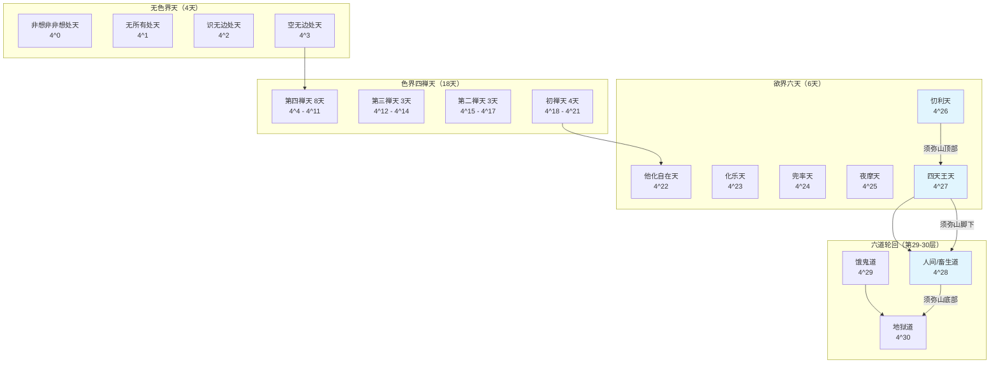

> [!abstract] 概述
> 本文详细阐述佛法中的完整世界结构，包括须弥山的位置与结构、无色界四天、色界四禅九天、欲界六天以及六道轮回的层次关系。全文天层采用佛教经典中的标准从高到低排列，光子能量按规则递增：最高天（非想非非想处天）为4^0，每向下一层能量单位乘4递增，人间为4^28。
>
> 本笔记是[[完整的世界观]]中**宇宙观**部分的具体展开，详细描述了佛法中的世界层次结构。

# 须弥山的位置与结构
 
> [!info] 核心概念
> 须弥山是连接人间、四天王天、忉利天的柱状结构，从人间向上穿过四天王天，到达忉利天山顶。须弥山只贯穿这三层，往上就是空居天，不再继续贯穿。
 
> [!note] 基本特征
> **起点**：人间山脚位置（银河系边远地区）
> **终点**：忉利天（须弥山顶）
> **物理形态**：像一个大头钉往下插进来的倒立圆锥体，连接不同世界球
> **贯穿范围**：从人间向上穿过四天王天，到达忉利天山顶
> **银河系关系**：银河系不是须弥山，须弥山是穿透银河系和上面世界连接的柱子。银河系中间的黑洞部分是须弥山穿透人间的位置，是须弥山与上一个世界连接之处
> **银河系性质**：银河系是一个独立的小世界（初禅天及以下的世界），不是须弥山。每一个银河系都是一个独立的小世界，每一个小世界都有一个须弥山。
> **视觉特征**：在我们眼中是一片黑暗，因为那里的光子能量单位（4^27）与人间的光子（4^28）不同
> **山顶结构**：须弥山顶在忉利天，山顶有帝释天的天宫
> **与人间关系**：人间位于须弥山山脚到快掉进海水的地方，在银河系4个旋臂之一的接近末端处，属于南天王的负责地区
 
# 三界二十八天结构
 
## 无色界天（4天）

> [!info] 排列规则
> 标准排列：从高到低（非想非非想处天 → 无所有处天 → 识无边处天 → 空无边处天）
> 光子能量：从高到低递增（4^0 → 4^1 → 4^2 → 4^3）

| 层级 | 天界名称 | 能量单位 | 数学表达 | 特征描述 |
|------|----------|----------|----------|----------|
| 最高 | 非想非非想处天 | 1光子 | 4^0 | 身体是发光球体（阳神），能量最低 |
| 中等 | 无所有处天 | 4光子 | 4^1 | 4个单位1光子组成正四面体 |
| 中等 | 识无边处天 | 16光子 | 4^2 | 4的二次方结构 |
| 最低 | 空无边处天 | 64光子 | 4^3 | 4的三次方，能量最高 |
 
## 色界四禅天（18天）

> [!info] 排列规则
> 标准排列：从高到低，能量单位递增（天层越低能量越高）
 
### 第四禅天（8天）

| 层级 | 天界名称 | 能量单位 | 数学表达 | 特征描述 |
|------|----------|----------|----------|----------|
| 最高 | 无烦天 | 4^4光子 | 4^4 | 色界最高天 |
| 中等 | 无热天 | 4^5光子 | 4^5 | - |
| 中等 | 善见天 | 4^6光子 | 4^6 | - |
| 中等 | 善现天 | 4^7光子 | 4^7 | - |
| 中等 | 色究竟天 | 4^8光子 | 4^8 | - |
| 中等 | 无想天 | 4^9光子 | 4^9 | 特征出现黑暗 |
| 中等 | 福生天 | 4^10光子 | 4^10 | - |
| 中等 | 广果天 | 4^11光子 | 4^11 | - |
 
### 第三禅天（3天）

| 层级  | 天界名称 | 能量单位   | 数学表达 | 特征描述              |
| --- | ---- | ------ | ---- | ----------------- |
| 最高  | 遍净天  | 4^12光子 | 4^12 | 球面分成1000个小球（防止造业） |
| 中等  | 无量净天 | 4^13光子 | 4^13 | -                 |
| 最低  | 少净天  | 4^14光子 | 4^14 | -                 |
 
### 第二禅天（3天）

| 层级  | 天界名称 | 能量单位   | 数学表达 | 特征描述             |
| --- | ---- | ------ | ---- | ---------------- |
| 最高  | 光音天  | 4^15光子 | 4^15 | -                |
| 中等  | 无量光天 | 4^16光子 | 4^16 | -                |
| 最低  | 少光天  | 4^17光子 | 4^17 | 在少净天下面又长出1000个小球 |
 
### 初禅天（4天）

| 层级  | 天界名称 | 能量单位   | 数学表达 | 特征描述  |
| --- | ---- | ------ | ---- | ----- |
| 最高  | 大梵天  | 4^18光子 | 4^18 | -     |
| 中等  | 梵辅天  | 4^19光子 | 4^19 | -     |
| 中等  | 梵众天  | 4^20光子 | 4^20 | -     |
| 最低  | 无云天  | 4^21光子 | 4^21 | 色界最低天 |
 
## 欲界六天（6天）

> [!info] 排列规则
> 标准排列：从高到低，须弥山贯穿其中三层（四天王天、忉利天与人间连接）

| 层级  | 天界名称      | 能量单位   | 数学表达 | 须弥山关联  | 特征描述             |
| --- | --------- | ------ | ---- | ------ | ---------------- |
| 最高  | 他化自在天     | 4^22光子 | 4^22 | 无关联    | 欲界最高天            |
| 中等  | 化乐天       | 4^23光子 | 4^23 | 无关联    | -                |
| 中等  | 兜率天       | 4^24光子 | 4^24 | 无关联    | -                |
| 中等  | 夜摩天       | 4^25光子 | 4^25 | 无关联    | -                |
| 中等  | 忉利天（三十三天） | 4^26光子 | 4^26 | 顶部（山顶） | 帝释天宫所在地          |
| 最低  | 四天王天      | 4^27光子 | 4^27 | 中部     | 分成四个部分，由四个天王分别管理 |
 
# 六道轮回

| 层次   | 道名     | 能量单位   | 数学表达 | 位置关系    | 特征描述             |
| ---- | ------ | ------ | ---- | ------- | ---------------- |
| 第29层 | 人间、畜生道 | 4^28光子 | 4^28 | 须弥山山脚位置 | 在银河系4个旋臂之一的接近末端处 |
| 第29层 | 饿鬼道    | 4^29光子 | 4^29 | 与人间并行   | 光子能量单位比人间稍大      |
| 第30层 | 地狱道    | 4^30光子 | 4^30 | -       | -                |

> [!note] 层次总结
> 总计：从无色界到欲界共28天，加上人间等构成29层，地狱为第30层。
 
# 空间结构

> [!example] 宇宙结构比喻
> 整个宇宙像洋葱一样层层递进，外层天界空间是内层天界的64倍，由须弥山这个柱状结构将不同世界串联起来，形成"十亿个串串"的大世界结构。

## 宇宙层次结构图

> [!note] 结构特点
> 1. **须弥山顶部**在忉利天（三十三天），帝释天宫所在地
> 2. **中间穿过**四天王天，由四大天王分别管理四个方向
> 3. **底部到达**人间山脚位置，人间位于第29层
> 4. **贯穿范围**：须弥山只贯穿欲界的这三个层次，不贯穿色界和无色界
 
