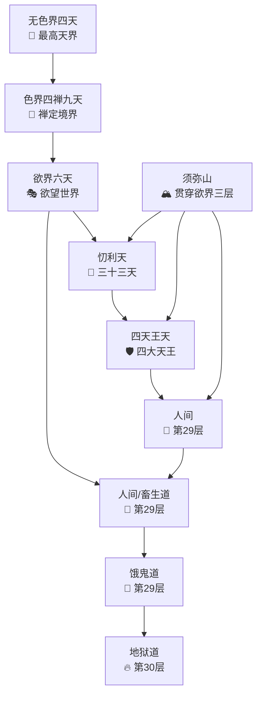

> [!abstract] 概述
> 本文详细阐述佛法中的完整世界结构，包括须弥山的位置与结构、无色界四天、色界四禅九天、欲界六天以及六道轮回的层次关系。

# 须弥山的位置与结构

> [!note] 核心概念
> 须弥山是连接人间、四天王天、忉利天的柱状结构，从人间向上穿过四天王天，到达忉利天山顶。须弥山只贯穿这三层，往上就是空居天，须弥山不再继续贯穿。

## 基本特征

- **起点**：人间山脚位置（银河系边远地区）
- **终点**：忉利天（须弥山顶）
- **物理形态**：像一个大头钉往下插进来的倒立圆锥体，连接不同世界球
- **贯穿范围**：从人间向上穿过四天王天，到达忉利天山顶
- **银河系关系**：银河系不是须弥山，须弥山是穿透银河系和上面世界连接的柱子。银河系中间的黑洞部分是须弥山穿透人间的位置，是须弥山与上一个世界连接之处
- **银河系性质**：银河系是一个独立的小世界（初禅天及以下的世界），不是须弥山。每一个银河系都是一个独立的小世界，每一个小世界都有一个须弥山。
- **视觉特征**：在我们眼中是一片黑暗，因为那里的光子能量单位（4^27）与人间的光子（4^28）不同
- **山顶结构**：须弥山顶在忉利天，山顶有帝释天的天宫
- **与人间关系**：人间位于须弥山山脚到快掉进海水的地方，在银河系4个旋臂之一的接近末端处，属于南天王的负责地区

---

# 三界二十八天结构

## 无色界天（4天）

> [!info] 排列顺序
> 按照从低到高的顺序排列（空无边处天→识无边处天→无所有处天→非想非非想处天），光子能量单位从低到高以4倍递增（4³→4²→4¹→4⁰）。

| 天界          | 层级  | 能量单位 | 数学表达 | 特征               |
| ----------- | --- | ---- | ---- | ---------------- |
| **空无边处天**   | 最低  | 64光子 | 4³光子 | 4的三次方，能量最高       |
| **识无边处天**   |     | 16光子 | 4²光子 | 4的二次方            |
| **无所有处天**   |     | 4光子  | 4¹光子 | 4个单位1光子组成正四面体    |
| **非想非非想处天** | 最高  | 1光子  | 4⁰光子 | 身体是发光球体（阳神），能量最低 |
|             |     |      |      |                  |

## 色界四禅（9天）

> [!info] 排列顺序
> 以下天界按照从高到低的顺序排列，能量单位递增（天层越低能量越高）。

### 上五天（净居五天）

| 天界       | 能量单位  | 层级  | 说明    |
| -------- | ----- | --- | ----- |
| **无烦天**  | 4¹²光子 | 最高  | 色界最高天 |
| **无热天**  | 4¹¹光子 |     |       |
| **善见天**  | 4¹⁰光子 |     |       |
| **善现天**  | 4⁹光子  |     |       |
| **色究竟天** | 4⁸光子  |     |       |

### 下四天

| 天界      | 能量单位 | 层级  | 特征    |
| ------- | ---- | --- | ----- |
| **无想天** | 4⁷光子 |     | 出现黑暗  |
| **福生天** | 4⁶光子 |     |       |
| **广果天** | 4⁵光子 |     |       |
| **无云天** | 4⁴光子 | 最低  | 色界最低天 |

## 三禅天（3天）

> [!info] 排列顺序：从高到低

| 天界       | 层级  | 特征                    |
| -------- | --- | --------------------- |
| **遍净天**  | 最高  | 第三天，球面分成1000个小球（防止造业） |
| **无量净天** |     |                       |
| **少净天**  | 最低  |                       |

## 二禅天（3天）

> [!info] 排列顺序：从高到低

| 天界 | 层级 | 特征 |
| ---- | ---- | ---- |
| **光音天** | 最高 |      |
| **无量光天** |      |      |
| **少光天** | 最低 | 在少净天下面又长出1000个小球 |

## 初禅天（3天）

> [!info] 排列顺序：从高到低

| 天界      | 层级  | 特征  |
| ------- | --- | --- |
| **大梵天** | 最高  |     |
| **梵辅天** |     |     |
| **梵众天** | 最低  |     |

## 欲界六天（须弥山贯穿其中三层）

> [!info] 排列顺序
> 欲界六天按照从高到低的顺序排列，须弥山贯穿其中三层。

| 天界            | 层级  | 能量单位  | 位置      | 特征               | 须弥山关系 |
| ------------- | --- | ----- | ------- | ---------------- | ----- |
| **他化自在天**     | 最高  | 4²²光子 |         | 欲界最高天            |       |
| **化乐天**       |     | 4²³光子 |         |                  |       |
| **兜率天**       |     | 4²⁴光子 |         |                  |       |
| **夜摩天**       |     | 4²⁵光子 |         |                  |       |
| **忉利天**（三十三天） |     | 4²⁶光子 | 须弥山顶位置  | 帝释天宫所在地          | 须弥山顶部 |
| **四天王天**      | 最低  | 4²⁷光子 | 须弥山中间位置 | 分成四个部分，由四个天王分别管理 | 须弥山中部 |

---

# 六道轮回

## 各道层次

| 道          | 层次   | 能量单位  | 位置      | 特征               |
| ---------- | ---- | ----- | ------- | ---------------- |
| **人间、畜生道** | 第29层 | 4²⁸光子 | 须弥山山脚位置 | 在银河系4个旋臂之一的接近末端处 |
| **饿鬼道**    | 第29层 | 4²⁹光子 | 与人间并行   | 光子能量单位比人间稍大      |
| **地狱道**    | 第30层 | 4³⁰光子 |         |                  |

> [!important] 层次总结
> **总计**：从无色界到欲界共28天，加上人间等构成29层，地狱为第30层。

## 空间结构

> [!info] 宇宙结构比喻
> 整个宇宙像洋葱一样层层递进，外层天界空间是内层天界的64倍，由须弥山这个柱状结构将不同世界串联起来，形成"十亿个串串"的大世界结构。

**结构特点**：
- 须弥山顶部在忉利天（三十三天），帝释天宫所在地
- 中间穿过四天王天，由四大天王分别管理四个方向
- 底部到达人间山脚位置，人间位于第29层
- 须弥山只贯穿欲界的这三个层次，不贯穿色界和无色界

### 宇宙层次结构图示

---
*最后更新：2026-01-20*
