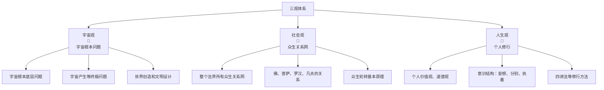

> [!abstract] 概述
> 本文阐述佛法的完整世界观，包括三大底层设定、三观体系和两条逻辑主线，为理解佛法提供完整的理论框架。

# 佛法三大底层设定

## 自性恒常

> [!info] 核心定义
> 所有众生都有不生不灭的自性，自性就是根本意识，遍虚空，也叫阿赖耶识、根本识。

**关键推论**：
既然所有众生自性不生不灭还遍虚空，那在意识遍虚空的众生眼里，我们的一举一动，一言一行都在他们的意识中，因此念佛，思佛求加持，他们都知道。

## 初妄无因

> [!info] 核心定义
> 自性当中没有理由地产生妄想，这是自性的性质，从此延伸出心识发展过程。

**发展过程**：
这个过程就是从意识遍虚空的状态一步一步发展为意识执着于一小块身体进行生死轮转的过程。

## 诸佛同体

> [!info] 核心定义
> 所有自性重叠在一起，这是自性的存在方式，佛的意识遍虚空即指此。

**业力原理**：
这就是业力形成的根本原因，其他意识对你不好的情绪将直接影响到你，同理其他意识对你的祝福也会直接影响到你，要给自性都是重叠在一起的。

**加持原理**：
因此，诸佛菩萨的祝福加持力也会层层叠加。

---

## 比喻说明

> [!example] 糖水比喻
> 假如一壶水就是无尽虚空的话，内有无数星球，无数世界的话，那意识遍虚空就可以理解为，六道轮转的众生意识就相当于一颗糖，里面有无数的糖。

**修行过程**：
当他一步一步放下执着，分别和妄想的时候糖就会在这一壶水中融化，直到扩散到一整壶水。

**意识覆盖**：
这一壶水中，所有的众生，所有的世界都被他的意识覆盖住，他自然也就能感知这个世界上所有人在干什么，在想什么。

> [!note] 重要说明
> 注意这一壶水并非无尽虚空，无数的糖都融化覆盖整个虚空，就相当于无数意识覆盖整个虚空，层层重叠在一起。

**最终结论**：
这个遍虚空的意识就是自性，所有自性层层重叠就是诸佛同体。

---

# 三观体系

> [!abstract] 体系概述
> 佛法的完整世界观由三个相互关联的层面构成：宇宙观、社会观、人生观。这三个层面共同构成了理解佛法的完整框架。

## 🌌 宇宙观

**核心问题**：宇宙的根本底层问题、宇宙产生等终极问题、世界创造和文明设计

### 主要内容
- **宇宙根本底层问题**：探讨宇宙的本质和起源
- **宇宙产生等终极问题**：解析宇宙生成的深层原理
- **世界创造和文明设计**：理解世界是如何被创造和设计的

## 👥 社会观

**核心问题**：整个法界所有众生关系网、佛、菩萨、罗汉、凡夫的关系、众生轮转基本原理

### 主要内容
- **整个法界所有众生关系网**：分析所有众生之间的相互关系
- **佛、菩萨、罗汉、凡夫的关系**：理解不同修行境界之间的关系
- **众生轮转基本原理**：掌握众生轮回转世的基本规律

## 👤 人生观

**核心问题**：个人价值观、道德观、意识结构、修行方法

### 主要内容
- **个人价值观、道德观**：建立正确的价值观和道德标准
- **意识结构：妄想、分别、执着**：理解心识的三个层次
- **四谛法等修行方法**：掌握具体的修行实践方法

## 三观关系图示

> [!tip] 使用建议
> 虽然Mermaid图表需要点击展开，但它提供了清晰的视觉关系。您也可以直接阅读上面的文字描述来理解三观体系的结构。

## 其他相关文章

- [[人类文明发展规律]] - 探讨文明发展的周期性规律
- [[从阿罗汉到凡夫]] - 修行境界的堕落与回归
- [[完整的世界结构]] - 世界构成的完整说明

## 两条逻辑主线

### 第一条线：初妄无因线

[[初妄无因逻辑线]]

> [!info] 逻辑线内容
> 初妄无因线阐述心识从自性到妄想、分别心、执着的发展过程，以及逆向的修行次第。

#### 逻辑线主要内容

1. **心识发展** ⬇️
   - 自性 → 妄想 → 分别心 → 执着（堕落过程）

2. **修行次第** ⬆️
   - 执着 → 分别心 → 妄想 → 自性（修行过程）

> [!info] 逻辑线内容
> 初妄无因线阐述心识从自性到妄想、分别心、执着的发展过程，以及逆向的修行次第。

#### 逻辑线主要内容

1. **心识发展** ⬇️
   - 自性 → 妄想 → 分别心 → 执着（堕落过程）

2. **修行次第** ⬆️
   - 执着 → 分别心 → 妄想 → 自性（修行过程）

#### 逻辑线图示

### 第二条线：诸佛同体线（自性重叠逻辑线）

[[自性重叠逻辑线]]

> [!info] 逻辑线内容
> 诸佛同体线涵盖了从业力原理到传法实践的完整体系，是佛法实践的重要指导。

#### 逻辑线主要内容

1. **基础原理** 🔗
   - 业的原理 → 因果定律 → 法界最初故事

2. **发心成佛** 🌟
   - 七级发心 → 继承成佛 → 分家成佛

3. **创世管理** 🌍
   - 创世 → 众生轮转 → 文明设计

4. **传法实践** 📚
   - 传法团队建设 → 四大职业 → 度人流程 → 消业指导

#### 逻辑线图示

---

# 实践要点

## 核心理解

- **深刻理解"诸佛同体"真相**
- **佛菩萨意识遍虚空**
- **有问题直接向佛菩萨求帮助**

## 佛经阅读方法

- **区别义理和故事**
- **义理是重点**：意识结构和修行次第
- **将内容往"妄想、分别、执着"框架上套**

## 成就标准

1. **能用自己语言向外行人讲清楚**
2. **形成完整框架，各知识点找到相应位置**
3. **所有知识点形成完整逻辑**

> [!success] 框架价值
> 这个框架涵盖了从宇宙真相到个人修行的完整体系，掌握了这个大框架，就能在佛法的学习中找到正确的方向和定位。

---
*最后更新：2026-01-20*

