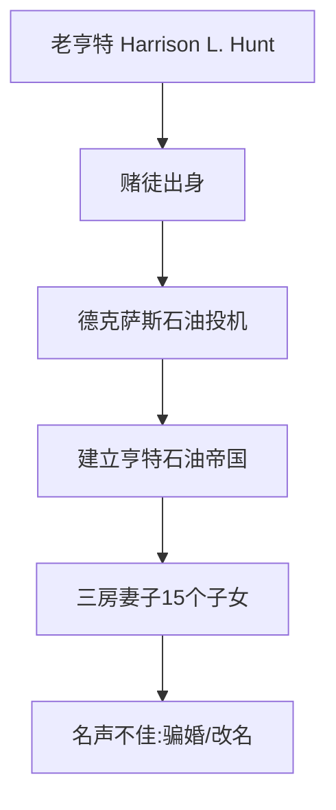
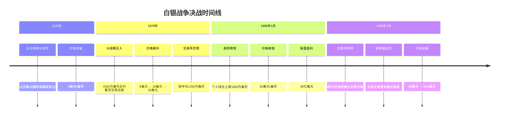
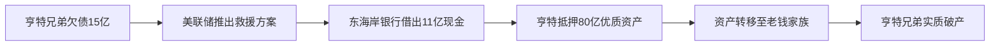

# 十年白银战争（1970-1980）

> [!abstract] 核心摘要
> 1970-1980年间，德克萨斯石油大亨**班克·亨特**和**赫伯特·亨特**兄弟试图通过大量囤积现货白银来垄断全球白银市场。这场持续十年的金融战役从1970年白银1.5美元/盎司开始，到1980年3月达到50美元/盎司的顶峰，最终在美国联邦储备委员会、商品交易所和东海岸老钱家族的联合打压下崩溃，亨特兄弟从世界首富沦为破产。

## 一、金银基础知识

### 1.1 黄金的独特性

> [!note] 黄金的物理特性
> - **唯一性**：黄金是宇宙中唯一在富氧环境下保持游离单金属态的元素
> - **抗腐蚀性**：自然界中任何物质都不能腐蚀黄金
> - **稀缺性**：黄金是超新星爆发后核聚变的最终产物，地球储量极少

### 1.2 白银的特性

> [!note] 白银的工业属性
> - **伴生性**：白银大量伴生于铜矿、金矿
> - **易氧化**：在富氧环境下容易生锈
> - **工业需求**：无线电、航空、航天等工业领域不可或缺

### 1.3 金银的历史地位

| 金属 | 历史地位 | 特点 | 金银比（历史） |
|------|----------|------|----------------|
| **黄金** | 主币、天然货币 | 永恒性、稀缺性、各文明共同认可 | 1:10（天然伴生矿比例） |
| **白银** | 辅币、工业金属 | 数量多、易冶炼、易分割 | 随银矿开发而变化 |

> [!info] 金银比的历史演变
> - **古代**：天然金银伴生矿比例约为1:10
> - **西班牙大航海**：墨西哥大银矿开发后，白银相对贬值
> - **中国**：长期是白银帝国，但缺乏大银矿，白银价格较高

## 二、亨特兄弟家族背景

### 2.1 老亨特（哈里森·拉斐尔·亨特）

**关键特点**：
- 欧洲移民，贫困家庭出身
- 天生赌徒，靠扑克牌起家
- 德克萨斯石油投机成功
- 三房正式妻子，15个子女
- 名声不佳（骗婚、频繁改名）

### 2.2 班克·亨特的发家史

> [!success] 利比亚65号油田的奇迹
> - **时间**：1961年
> - **背景**：在巴基斯坦赔光1100万美元后
> - **机遇**：利比亚油田招标，盲选65号地块
> - **结果**：发现非洲最大油田
> - **交易**：出让50%股权给英国石油公司换取开发资金
> - **财富**：35岁身价70亿美元，成为世界首富

**后续投资**：
- 美国500万英亩土地（约3000万亩）
- 德克萨斯养牛场、糖厂
- 堪萨斯酋长橄榄球队（NFL）
- 必胜客等餐饮连锁

## 三、十年白银战争时间线（1970-1980）

### 3.1 第一阶段：试水期（1970-1973）

| 时间 | 事件 | 白银价格 | 亨特兄弟持仓 |
|------|------|----------|--------------|
| **1970年** | 首次买入试水 | 1.5美元/盎司 | 20万盎司（30万美元） |
| **1971年** | 价格翻倍 | 3美元/盎司 | 继续持有 |
| **背景** | 布雷顿森林体系，美国禁止私人持有黄金 | | |

> [!important] 投资动机
> 1. **避险需求**：冷战高峰、越南战争、通货膨胀
> 2. **法律限制**：美国禁止私人投资黄金
> 3. **赌徒性格**：从避险变为all in投机

### 3.2 第二阶段：全面进攻（1973-1974）

| 时间 | 事件 | 关键行动 |
|------|------|----------|
| **1973年** | 卡扎菲没收利比亚油田 | 激发复仇心理 |
| **1973-1974** | 大规模买入 | 5500万盎司（占全球8%） |
| **1974年** | 实物交割危机 | 从交易所提现货到德克萨斯 |
| **1974年** | 德克萨斯州征税 | 征收5%特许税 |
| **1974年** | 白银转运瑞士 | 3架波音707，12名神枪手押运 |

**持仓详情**：
- **总持仓**：5500万盎司
- **运往瑞士**：4000万盎司（分散在6个地下仓库）
- **留在美国**：1500万盎司
- **年保管费**：300万美元

### 3.3 第三阶段：国际联盟尝试（1975-1977）

> [!failure] 国际联盟失败记录
>
> | 国家/对象 | 时间 | 计划内容 | 失败原因 |
> |-----------|------|----------|----------|
> | **伊朗** | 1975年3月 | 联合巴列维国王坐庄 | 文化差异，被认作骗子 |
> | **沙特** | 1975年4月 | 与费萨尔国王会面 | 国王被刺杀，政局混乱 |
> | **菲律宾** | 1975年 | 白银换糖厂，打破美元石油体系 | IMF威胁断贷，菲律宾退出 |

**其他尝试**：
- **1977年**：收购日光银矿28%股权（被小股东推翻协议）
- **1977年**：声东击西做多大豆（被交易所修改规则限制）

### 3.4 第四阶段：最终决战（1978-1980）

## 四、关键战役与转折点

### 4.1 交易所规则战

> [!warning] 交易所规则修改记录
>
> | 时间 | 交易所 | 规则修改内容 | 针对目标 |
> |------|--------|--------------|----------|
> | **1979年底** | 纽约/芝加哥 | 个人持仓上限300万盎司，保证金大幅上调 | 限制亨特兄弟持仓 |
> | **1980年1月7日** | 纽约商品交易所 | 持仓上限1000万盎司，超限强制平仓 | 直接打击亨特仓位 |
> | **1980年1月21日** | 纽约/芝加哥 | 停止白银交易，只接受平仓 | 彻底封杀多头上攻 |

### 4.2 国家机器介入

| 机构 | 行动 | 时间 | 效果 |
|------|------|------|------|
| **美联储** | 主席沃克宣布美元加息 | 1980年3月14日 | 美元走强，白银下跌 |
| **财政部** | 联合美联储、交易所制定打压方案 | 1980年3月 | 协调国家力量 |
| **交易所** | 修改规则、提高保证金、停止交易 | 1979-1980 | 直接打击多头 |

### 4.3 亨特兄弟的持仓巅峰

**1980年3月持仓统计**：
- **瑞士现货**：4000万盎司（早期存入）
- **新增现货**：900万盎司（1979年运往瑞士）
- **期货合约**：9000万盎司（1980年3月15日交割）
- **总控制量**：约1.3亿盎司
- **全球可交割量**：仅2亿盎司

## 五、结局与教训

### 5.1 白银星期四（Silver Thursday）

> [!danger] 1980年3月27日 - 白银星期四
> - **开盘价**：15.8美元/盎司
> - **收盘价**：10.8美元/盎司
> - **单日跌幅**：约50%
> - **亨特成本**：现货10美元，期货35美元
> - **最终欠款**：15亿美元

### 5.2 美联储的"救援"方案

**方案实质**：以救援为名，行掠夺之实

### 5.3 最终结局

| 人物 | 结局 | 时间 | 备注 |
|------|------|------|------|
| **班克·亨特** | 个人破产 | 1988年 | 净资产500万，欠税9000万 |
| **赫伯特·亨特** | 同样破产 | 1980年代 | 家族财富归零 |
| **白银价格** | 回归稳态 | 1980年后 | 稳定在17美元左右 |

**关键数据**：
- **战争时长**：10年（1970-1980）
- **价格涨幅**：1.5美元 → 50美元（33倍）
- **亨特投入**：数十亿美元
- **对手投入**：相当规模的资金
- **最终结果**：新钱被老钱剿灭

## 六、历史启示与当前市场分析

### 6.1 历史对比分析

> [!tip] 1970年代 vs 当前市场
>
> | 维度 | 1970年代 | 当前（2026年） | 相似度 |
> |------|----------|----------------|--------|
> | **国际格局** | 美苏冷战，多极化发展 | 中美竞争，多极化 | ★★★★★ |
> | **货币体系** | 布雷顿森林瓦解 | 美元信用动摇 | ★★★★☆ |
> | **通胀环境** | 恶性通货膨胀 | 全球通胀压力 | ★★★★☆ |
> | **战争因素** | 越南战争 | 地区冲突不断 | ★★★☆☆ |
> | **挑战者** | 亨特兄弟（新钱） | 马斯克等（新贵） | ★★★★☆ |
> | **建制派** | 东海岸老钱家族 | 华尔街建制派 | ★★★★★ |

### 6.2 市场现状分析

**白银供需基本面**：
- **年产量**：25,000吨（全球）
- **工业需求**：持续增长（光伏、电子等）
- **供需关系**：长期倒挂（需求 > 产量）
- **中国角色**：最大生产国 + 最大消费国

**黄金对比**：
- **涨幅对比**：黄金从1800美元→5000美元（2.7倍）
- **历史涨幅**：白银战争期间33倍
- **当前阶段**：可能刚刚开始

### 6.3 关键启示

> [!quote] 核心启示
> 1. **金融规则是假象**：只要有颠覆者出现，规则随时可修改
> 2. **新钱 vs 老钱**：金融战争本质是阶级战争
> 3. **国家机器力量**：当建制派利益受威胁时，国家力量会介入
> 4. **实物 vs 纸面**：实物交割能力是终极武器

## 七、投资建议

### 7.1 基本原则

> [!success] 投资黄金白银的三大原则
> 1. **不加杠杆**：避免成为规则修改的牺牲品
> 2. **持有实物**：ETF可接受，但需选择有实物背书的
> 3. **长期持有**：以5-10年为周期，忽略短期波动

### 7.2 具体建议

| 投资者类型 | 建议配置 | 具体方式 | 注意事项 |
|------------|----------|----------|----------|
| **普通投资者** | 资产的5-10% | 实物金银或ETF | 避免杠杆，长期持有 |
| **高净值投资者** | 资产的10%以上 | 实物存储+部分ETF | 分散存储地点 |
| **机构投资者** | 战略配置 | 实物+矿业股+期货套保 | 注意政策风险 |

### 7.3 风险提示

> [!caution] 主要风险
> - **政策风险**：政府可能修改规则或限制交易
> - **存储风险**：实物金银需要安全存储
> - **流动性风险**：极端情况下可能无法变现
> - **机会成本**：可能错过其他投资机会

### 7.4 当前操作建议

1. **黄金**：核心配置，相对稳健
2. **白银**：卫星配置，波动更大，潜力更高
3. **比例**：根据风险偏好调整（如7:3或6:4）
4. **时机**：定投为主，避免一次性重仓

---

> [!note] 最后提醒
> 历史不会简单重复，但会押韵。十年白银战争告诉我们：在乱世中，实物资产是最后的避风港，但挑战建制派的代价可能是毁灭性的。普通投资者最好的策略是持有实物、不加杠杆、耐心等待。
