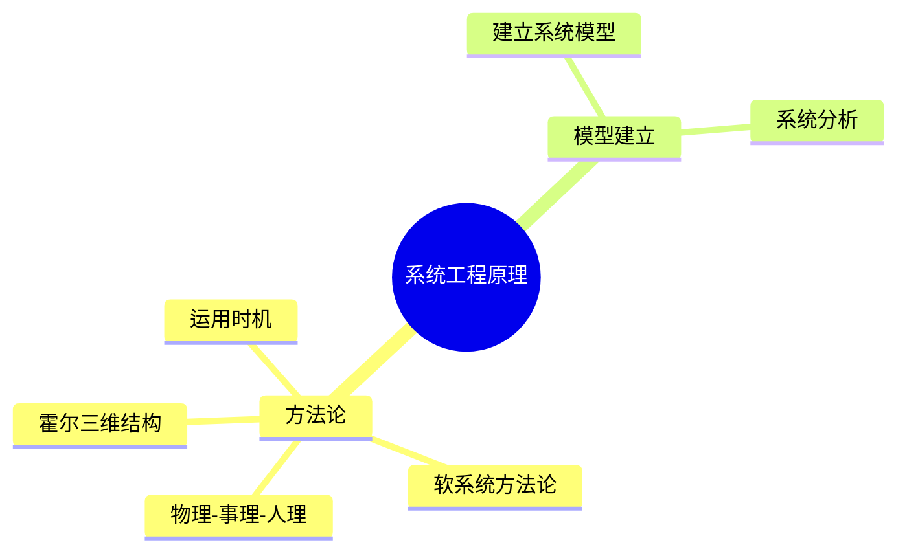
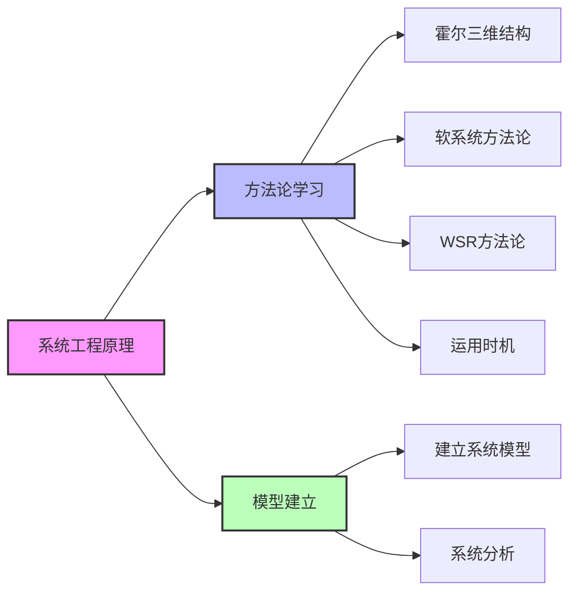

# 系统工程原理

> [!abstract] 学习定位
> 以实用主义为导向学习系统工程原理，聚焦核心方法论与实际应用场景。

---

## 知识体系概览

---

## 系统工程方法论

> [!info] 核心方法
> 系统工程方法论是处理复杂系统问题的思维框架与工具集合

| 方法 | 适用场景 | 核心特点 |
|:---:|:---------|:---------|
| [[霍尔三维结构]] | 结构良好的硬系统/工程项目 | 线性阶段管控、时间-逻辑-知识三维 |
| [[软系统方法论]] | 结构不良、目标模糊的软问题 | 多元视角、学习迭代、共识构建 |
| [[物理-事理-人理方法论（WSR）]] | 技术+人文复合的复杂系统 | 三维协同、客观规律+流程+人际 |
| [[系统工程方法论运用时机]] | 方法选型决策 | 场景匹配、组合应用 |

---

## 系统模型建立

> [!tip] 模型与分析
> 系统建模与系统分析是系统工程的核心技术环节

| 主题 | 内容 |
|:---:|:-----|
| [[建立系统模型]] | 建模定义、必要性、方法（推理法/实验法/类似法）、原则与禁忌 |
| [[系统分析]] | 创造性方案开发、逻辑流程、四大原则 |

---

## 学习路径建议

---

## 快速导航

### 方法论篇

- `[[霍尔三维结构]]` - 硬系统工程的经典三维框架
- `[[软系统方法论]]` - 处理软问题的七步法
- `[[物理-事理-人理方法论（WSR）]]` - 三维协同方法论
- `[[系统工程方法论运用时机]]` - 如何选择合适的方法

### 案例篇

- `[[软系统方法案例分析]]` - 老旧小区加装电梯
- `[[WSR案例分析]]` - 老旧小区充电桩建设
- `[[方法论和工程技术综合集成案例]]` - 智慧社区、载人航天

### 工具篇

- `[[5W1H方法]]` - 结构化问题分析工具

### 模型篇

- `[[建立系统模型]]` - 系统建模的方法与原则
- `[[系统分析]]` - 系统分析的逻辑流程

---

## 相关标签

`#系统工程` `#方法论` `#系统建模` `#WSR` `#SSM` `#霍尔三维`

---

%%%
文档维护记录：
- 2024-01-15：创建系统工程原理索引
- 2024-01-20：添加Obsidian格式优化
%%%
