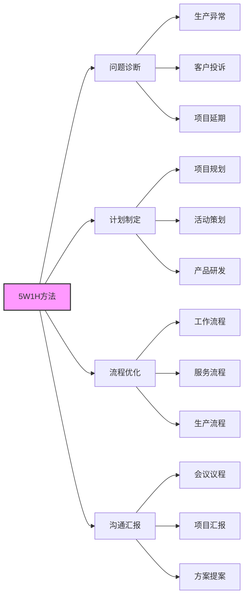

# 5W1H方法（六何分析法）

> [!abstract] 核心定位
> **结构化问题分析与决策工具**，通过6个维度全覆盖思考，避免片面性
>
> 核心价值：厘清逻辑、明确边界、落地可执行
>
> 适用范围：从问题诊断到方案制定的全场景

---

## 核心逻辑

> [!tip] 思维顺序
> 先定"**为什么做**"（Why），再明确"**做什么**"（What），最后落地"**怎么干**"（How）

$$
\text{Why} \rightarrow \text{What} \rightarrow \text{Who} \rightarrow \text{When} \rightarrow \text{Where} \rightarrow \text{How}
$$

---

## 六大维度详解

### 1. Why（为何）—— 目标与价值

> [!question] 核心问题
> - 为什么要做？
> - 核心价值是什么？
> - 不做的后果？

| 要点 | 说明 |
|:---:|:-----|
| **关键作用** | 对齐共识、论证必要性、化解抵触情绪 |
| **实操要点** | 答案要聚焦"核心价值"，避免空泛 |

> [!example] 示例对比
> - ❌ "优化服务"
> - ✅ "降低客户投诉率30%"

---

### 2. What（何事）—— 任务与交付物

> [!question] 核心问题
> - 要做什么具体事？
> - 核心成果（交付物）是什么？
> - 边界在哪里？

| 要点 | 说明 |
|:---:|:-----|
| **关键作用** | 界定范围、明确目标，避免执行中"跑偏" |
| **实操要点** | 明确"做什么"和"不做什么"，交付物要具体可衡量 |

> [!example] 示例对比
> - ❌ "做活动"
> - ✅ "策划一场300人线下产品发布会，产出10篇媒体报道"

---

### 3. Who（何人）—— 权责与参与方

> [!question] 核心问题
> - 谁牵头？谁执行？谁受益？谁监督？谁配合？

| 要点 | 说明 |
|:---:|:-----|
| **关键作用** | 明确权责、避免责任真空，确保协作顺畅 |
| **实操要点** | 每个角色对应具体职责，不模糊 |

> [!example] 示例对比
> - ❌ "团队负责"
> - ✅ "张三牵头方案设计，李四负责资源协调，王五监督进度"

---

### 4. When（何时）—— 时间与优先级

> [!question] 核心问题
> - 何时启动？何时完成？
> - 关键里程碑是什么？
> - 各环节优先级？

| 要点 | 说明 |
|:---:|:-----|
| **关键作用** | 管控进度、合理分配时间，避免拖延 |
| **实操要点** | 时间节点明确到具体周期/日期，区分核心与次要任务 |

> [!example] 示例对比
> - ❌ "下个月完成"
> - ✅ "5月10日前完成方案初稿，5月20日前定稿"

---

### 5. Where（何地）—— 地点与范围

> [!question] 核心问题
> - 在哪里做？
> - 执行范围是什么？
> - 环境有什么约束？

| 要点 | 说明 |
|:---:|:-----|
| **关键作用** | 确定场地、规避环境风险，明确影响边界 |
| **实操要点** | 结合场景考虑约束 |

> [!example] 示例对比
> - ❌ "在公司做"
> - ✅ "在公司3号会议室开展培训，需提前确认设备兼容性"

---

### 6. How（如何）—— 方法与资源

> [!question] 核心问题
> - 具体怎么做？步骤是什么？
> - 需要哪些资源（人/财/物）？
> - 风险怎么应对？

| 要点 | 说明 |
|:---:|:-----|
| **关键作用** | 落地执行、规避风险，确保方案可行 |
| **实操要点** | 步骤拆解到"可直接动手"，资源与风险提前规划 |

> [!example] 示例对比
> - ❌ "做好推广"
> - ✅ "通过抖音+小红书投放，预算5万元，提前准备3套备选文案应对审核风险"

---

## 核心原则

> [!success] 四大原则
>
> | 原则 | 说明 |
> |:---:|:-----|
> | **全面性** | 6个维度缺一不可，避免遗漏关键信息 |
> | **逻辑性** | 严格遵循 Why→What→Who→When→Where→How 顺序 |
> | **可量化** | 每个维度答案尽量具体、可衡量，拒绝模糊表述 |
> | **迭代性** | 信息完善后可动态修正，适配场景变化 |

---

## 典型应用场景



| 场景类型 | 具体应用 |
|:--------:|:---------|
| **问题诊断** | 分析生产异常、客户投诉、项目延期等根源 |
| **计划制定** | 项目规划、活动策划、产品研发、学习计划 |
| **流程优化** | 梳理工作/服务/生产流程，消除冗余 |
| **沟通汇报** | 会议议程、项目汇报、方案提案（让表达更清晰） |

---

## 工具融合技巧

> [!info] 与其他方法论配合
>
> | 方法论 | 融合方式 |
> |:------:|:---------|
> | [[物理-事理-人理方法论（WSR）]] | 用5W1H细化物理（技术约束）、事理（流程步骤）、人理（参与方） |
> | [[软系统方法论]] | 用5W1H梳理丰富图中的利益相关者、行动节点 |
> | [[霍尔三维结构]] | 用5W1H明确时间维（节点）、逻辑维（步骤）、知识维（参与人） |

---

## 快速记忆口诀

> [!tip] 记忆口诀
>
> ```mermaid
> graph LR
>     A[Why定价值] --> B[What明任务]
>     B --> C[Who划权责]
>     C --> D[When控时间]
>     D --> E[Where锁场地]
>     E --> F[How落地执行]
>
>     style A fill:#f96,stroke:#333,stroke-width:2px
>     style F fill:#6f9,stroke:#333,stroke-width:2px
> ```

**Why定价值，What明任务，Who划权责，When控时间，Where锁场地，How落地执行**

---

## 5W1H检查清单

> [!checklist] 实施检查清单
>
> - [ ] **Why**：是否明确了核心价值和不做的后果？
> - [ ] **What**：是否界定了范围和具体交付物？
> - [ ] **Who**：是否明确了每个角色的权责？
> - [ ] **When**：是否设定了明确的时间节点？
> - [ ] **Where**：是否考虑了环境约束？
> - [ ] **How**：是否拆解了可执行的步骤？

---

## 相关文档

- [[系统工程方法论运用时机]] - 了解何时使用5W1H
- [[物理-事理-人理方法论（WSR）]] - 与WSR配合使用
- [[系统工程原理]] - 返回主目录

---

%%%
文档维护记录：
- 2024-01-15：初始创建
- 2024-01-20：添加Obsidian格式优化
%%%
