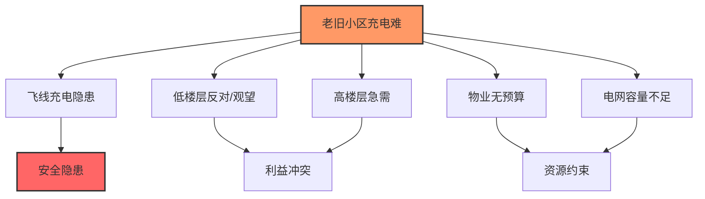
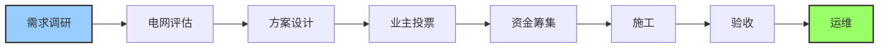
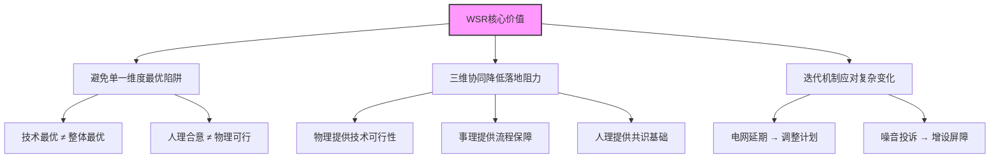

# WSR方法论案例分析：老旧小区充电桩建设项目

> [!abstract] 案例背景
> **场景**：老旧小区充电桩批量建设项目
>
> **特点**：典型技术+人文复合问题，物理/事理/人理矛盾突出
>
> **严格遵循**：WSR三维内涵 + 标准实施流程

---

## 项目前提

> [!warning] 问题情境
>
> | 维度 | 现状描述 |
> |:---:|:---------|
> **小区情况** | 30年房龄，业主电动车保有量大 |
> **核心问题** | 充电难且飞线充电隐患突出 |
> **资源约束** | 物业无专项预算，电网容量有限 |
| **利益冲突** | 低楼层担心噪音/辐射，高楼层急需充电位 |
| **协调困境** | 居委会协调力不足 |

---

## 一、WSR三维核心分析（调查阶段）

### 物理 W（Wuli）—— 客观约束 & 技术事实

> [!info] 物理 W：客观物质世界
>
> **核心任务**：认知客观、获取数据、明确技术边界

| 类别 | 具体内容 |
|:---:|:---------|
| **核心事实** | 小区电网最大负荷、车位数量、消防通道位置、充电桩安装技术标准、电磁辐射安全阈值 |
| **关键约束** | 现有电网容量不足需增容；地面车位紧张，地下车库管线复杂；消防新规严禁占用疏散通道 |
| **工具** | 电网负荷检测、车位测绘、电磁辐射模拟、消防合规评估 |

---

### 事理 S（Shili）—— 流程 & 方法设计

> [!info] 事理 S：做事的道理与方法
>
> **核心任务**：设计方案、优化流程、配置资源、建立执行机制

| 类别 | 具体内容 |
|:---:|:---------|
| **核心需求** | 制定分阶段建设方案、电网增容流程、资金分摊机制、施工管控方案、运维管理规则 |
| **关键流程** | 需求调研 → 电网评估 → 方案设计 → 业主投票 → 资金筹集 → 施工 → 验收 → 运维 |
| **工具** | PDCA循环、[[霍尔三维结构]]、项目进度甘特图、成本预算模型 |

---

### 人理 R（Renli）—— 人际协同 & 利益共识

> [!info] 人理 R：人际、组织、文化层面
>
> **核心任务**：凝聚共识、化解冲突、激励参与、构建信任

| 类别 | 具体内容 |
|:---:|:---------|
| **核心矛盾** | 低楼层（反对/观望）、高楼层（刚需）、物业（无预算）、电网公司（施工周期）、居委会（协调角色） |
| **关键任务** | 建立沟通机制、化解辐射担忧、设计合理出资方案、激励业主参与 |
| **工具** | [[软系统方法论]]丰富图、利益相关者分析、多轮沟通会、德尔菲法、业主代表小组 |

---

## 二、WSR完整实施流程（迭代循环）

> [!tip] WSR标准六步流程

### 1. 理解意图

**核心目标**：
- 消除飞线隐患
- 满足业主充电需求
- 兼顾各方利益
- 确保合规安全

---

### 2. 调查分析

完成上述物理/事理/人理三维调研，形成问题清单与约束边界

---

### 3. 构造策略（三维协同方案）

> [!example] 三维协同方案设计

| 维度 | 策略内容 |
|:---:|:---------|
| **物理** | 电网增容 + 智能充电桩（分时充电，错峰用电），安装位置避开卧室窗户，电磁辐射检测合格 |
| **事理** | 分两期建设（一期地面，二期地下），资金由"业主出资+政府补贴+电网公司优惠"组合，施工避开居民休息时段 |
| **人理** | 成立业主代表小组（覆盖各楼层），组织电磁辐射科普会，设计"梯度出资"方案（高楼层多承担，低楼层少承担/自愿） |

---

### 4. 选择方案

> [!success] 方案评估结果
>
> - 评估3套备选方案
> - 优先选"物理可行+事理高效+人理合意"的二期建设方案
> - **业主投票通过率超80%**

---

### 5. 协调实施

执行中动态协调：

| 问题 | 应对措施 |
|:---:|:---------|
| 电网增容延期 | 调整施工计划 |
| 部分业主投诉噪音 | 增设隔音屏障 |
| 同步推进问题 | 充电桩使用培训 |

---

### 6. 总结反思

- 项目验收后，业主满意度调查
- 收集运维问题
- 优化出资与运维机制
- 形成小区充电桩建设模板，为其他小区提供参考

---

## 三、WSR核心价值体现

> [!success] 三大核心价值

| 价值 | 说明 |
|:---:|:-----|
| **避免单一维度最优陷阱** | 比如只追求物理技术最优（大功率快充）而忽视人理抵触（噪音/辐射），或只强调人理合意（免费安装）而忽视物理技术约束（电网容量） |
| **三维协同降低落地阻力** | 物理提供技术可行性，事理提供流程保障，人理提供共识基础 |
| **迭代机制应对复杂变化** | 实施中出现的新问题（如电网延期、噪音投诉），通过三维动态协调快速解决 |

---

## 四、案例启示

> [!tip] WSR方法论关键要点

1. **三维必须协同**：物理、事理、人理缺一不可，单一维度最优不等于整体最优

2. **人理是关键**：技术方案再好，如果人理层面的共识没有建立，落地也会遇到阻力

3. **迭代是常态**：复杂系统问题不可能一步到位，需要在实施中不断调整优化

4. **工具要组合**：WSR不是孤立使用的，可以结合[[软系统方法论]]、[[霍尔三维结构]]、[[5W1H方法]]等工具

---

## 相关文档

- [[物理-事理-人理方法论（WSR）]] - WSR方法论详解
- [[软系统方法论]] - 处理人理问题的工具
- [[系统工程方法论运用时机]] - 何时使用WSR
- [[系统工程原理]] - 返回主目录

---

%%%
文档维护记录：
- 2024-01-15：初始创建
- 2024-01-20：添加Obsidian格式优化和Mermaid图表
%%%
