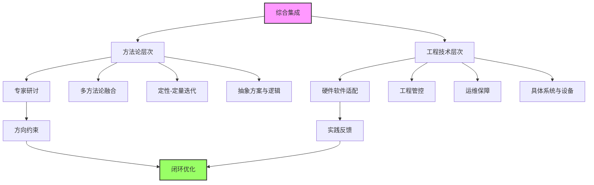
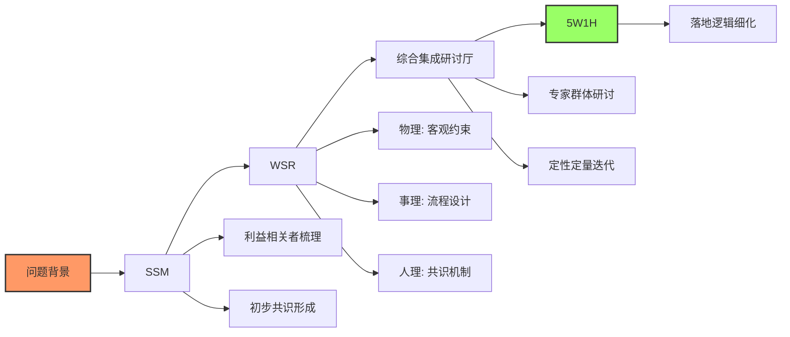

# 方法论和工程技术综合集成案例

> [!abstract] 核心定义
> 综合集成分为两个层次，各司其职又相互依托

---

## 两个层次的区别

> [!info] 层次对比
>
> | 维度 | 方法论层次 | 工程技术层次 |
> |:---:|:---------|:---------|
> **聚焦** | 顶层问题定义、共识构建、方案框架设计 | 技术实现与系统协同 |
> **核心** | 专家体系、数据信息体系、人机协同的定性-定量迭代 | 硬件、软件、工程管控技术整合 |
> **产出** | 可落地的顶层逻辑与行动框架 | 可运行的实体系统 |
> **解决** | "做什么、为什么做、怎么做的整体思路" | "技术如何落地、系统如何协同" |
> **适用** | 项目前期的问题定义与方案设计 | 项目中期的执行与验收阶段 |



---

## 案例一：成都智慧社区充电桩+安防一体化项目

### 一、方法论层次的综合集成（顶层设计阶段）

> [!tip] 问题背景
> 老旧小区飞线充电安全隐患突出，智能安防覆盖率低
>
> - 高楼层业主急需充电位，低楼层担心电磁辐射、施工噪音与隐私泄露
> - 物业无专项预算，小区电网容量不足，居委会协调资源有限
> - 多方利益诉求冲突明显

#### 综合集成过程

> [!info] 方法论融合路径



| 方法 | 应用内容 |
|:---:|:---------|
| [[软系统方法论]] | 用丰富图梳理业主、物业、电网公司、居委会等利益相关者的矛盾点与核心诉求，通过多轮沟通会形成"消除安全隐患、满足充电需求、兼顾各方利益"的初步共识 |
| [[物理-事理-人理方法论（WSR）]] | **物理**：小区电网最大负荷、车位分布、电磁辐射安全阈值等<br>**事理**：分两期建设流程、"业主梯度出资+政府补贴+电网公司优惠"的资金机制<br>**人理**：覆盖各楼层的业主代表小组、电磁辐射科普会与方案听证会 |
| 综合集成研讨厅 | 组织电气技术专家、物业管理人员、业主代表、政策研究员等跨领域群体，开展多轮定性研讨与定量验证 |
| [[5W1H方法]] | Why（消除隐患、提升居住品质）、What（建设20个智能充电桩+10套高清安防设备）、Who（业主代表小组牵头）、When（6个月分两期推进）、Where（地面停车场闲置区域+地下车库）、How（先电网增容再设备安装） |

#### 产出成果

智慧社区一体化建设顶层方案，包含：
- 三维协同框架
- 共识机制
- 分阶段实施路径
- 风险应对原则

---

### 二、工程技术层次的综合集成（落地执行阶段）

> [!tip] 核心技术需求
>
> | 需求类型 | 具体内容 |
> |:--------:|:---------|
| **数据互通** | 充电桩与安防系统的数据互通 |
| **电气适配** | 电网增容的电气适配问题 |
| **安全达标** | 控制电磁辐射达标 |
| **平台搭建** | 业主与物业共用的管理平台 |
| **稳定运行** | 系统长期稳定运行 |

#### 综合集成过程

> [!info] 工程技术集成路径

| 集成类型 | 具体内容 |
|:--------:|:---------|
| **硬件集成** | 选型适配小区电网负荷的交流/直流充电桩，搭配具备红外探测功能的高清摄像头、边缘计算网关与智能配电柜；统一硬件接口标准，优化设备布局，加装隔音屏障与电磁屏蔽装置 |
| **软件集成** | 开发充电桩管理系统与安防监控系统的接口程序，搭建基于云计算的智慧社区统一平台，配套业主APP与物业管理后台，采用加密协议保障隐私安全 |
| **工程管控集成** | 采用[[霍尔三维结构]]推进实施，时间维按"电网增容→设备安装→系统调试→验收交付"分阶段推进，逻辑维按"需求拆解→技术选型→施工执行→质量检测"分步落实 |
| **运维集成** | 构建"远程监控+现场巡检"的运维体系，通过平台实时监测设备状态，制定设备定期保养计划 |

#### 产出成果

可正常运行的智慧社区充电桩+安防一体化系统

---

### 三、两个层次的联动逻辑

> [!success] 双向闭环
>
> ```mermaid
> graph LR
>     A[方法论层次] -->|提供顶层约束与方向指引| B[工程技术层次]
>     B -->|反馈实施结果| A
>
>     A --> A1[WSR: 物理可行+人理合意]
>     A --> A2[分阶段实施路径]
>
>     B --> B1[电网增容成本高于测算]
>     B --> B2[APP操作复杂]
>
>     B1 --> A3[调整出资分摊比例]
>     B2 --> A4[优化软件界面]
>
>     style A fill:#bbf,stroke:#333,stroke-width:2px
>     style B fill:#bfb,stroke:#333,stroke-width:2px
> ```
>
> - **方法论→工程**：WSR明确的"物理可行、人理合意"原则，决定技术选型必须优先考虑低辐射、低噪音设备
> - **工程→方法论**：电网增容的实际成本高于测算值，业主代表小组结合技术反馈调整出资分摊比例

---

## 案例二：载人航天工程（神舟飞船与空间站对接任务）

### 一、方法论层次综合集成

> [!tip] 问题背景
> 需实现载人飞船与空间站的精准对接，保障航天员在轨驻留安全
>
> - 涉及多领域技术协同、复杂环境适应
> - 严格的可靠性要求
> - 典型的开放复杂巨系统问题

#### 综合集成过程

| 方法 | 应用内容 |
|:---:|:---------|
| [[物理-事理-人理方法论（WSR）]] | **物理**：太空真空、极端温度、微重力等环境约束<br>**事理**："发射→在轨飞行→交会对接→驻留→返回"的任务流程<br>**人理**：跨领域专家团队，多部门协同决策机制 |
| 综合集成研讨厅 | 组织专家群体开展定性研判与定量仿真，确定"三步走"任务规划 |
| [[软系统方法论]] | 梳理前期需求共识，明确"安全优先、分步验证"的核心原则 |
| [[5W1H方法]] | 细化任务逻辑，明确各阶段的核心目标、责任主体与时间节点 |

#### 产出成果

载人航天任务顶层方法论方案，包含：
- 任务规划
- 协同机制
- 技术验证路径

---

### 二、工程技术层次综合集成

> [!tip] 核心技术需求
>
> | 需求类型 | 具体内容 |
> |:--------:|:---------|
| **精准对接** | 飞船与空间站的精准交会对接 |
| **生命保障** | 生命保障系统稳定 |
| **协同控制** | 多系统协同控制问题 |
| **抗干扰** | 设备抗太空环境干扰的能力 |

#### 综合集成过程

| 集成类型 | 具体内容 |
|:--------:|:---------|
| **硬件集成** | 整合火箭推进系统、飞船姿态控制系统、对接机构、生命保障设备等核心硬件，统一机械接口与电气标准 |
| **软件集成** | 开发交会对接导航控制软件，融合激光雷达、GPS定位与惯性导航数据，搭建天地一体化测控系统 |
| **工程管控集成** | 按[[霍尔三维结构]]分阶段推进，从火箭发射、在轨飞行到对接完成，每个阶段设置严格的质量检测节点 |

#### 产出成果

可完成交会对接任务的飞船与空间站系统，以及配套的测控与运维体系

---

## 总结

> [!success] 两个层次的核心区别与联系
>
> | 维度 | 方法论层次 | 工程技术层次 |
> |:---:|:---------|:---------|
> **核心目标** | 构建共识、设计顶层框架 | 实现技术协同与实体交付 |
> **核心手段** | 专家研讨、多方法论融合、定性-定量迭代 | 硬件软件适配、工程管控、运维保障 |
> **产出结果** | 抽象的方案与逻辑 | 具体的系统与设备 |
> **适用阶段** | 项目前期的问题定义与方案设计 | 项目中期的执行与验收阶段 |
> **相互关系** | 为技术落地提供方向约束 | 为方法论优化提供实践反馈 |

---

## 相关文档

- [[物理-事理-人理方法论（WSR）]] - WSR方法论详解
- [[软系统方法论]] - SSM方法论详解
- [[霍尔三维结构]] - 工程管控框架
- [[5W1H方法]] - 方案细化工具
- [[系统工程原理]] - 返回主目录

---

%%%
文档维护记录：
- 2024-01-15：初始创建
- 2024-01-20：添加Obsidian格式优化和Mermaid图表
%%%
