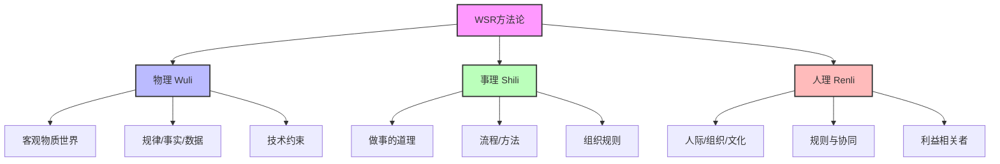
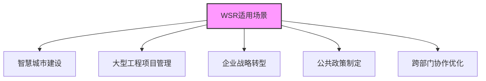

# 物理-事理-人理方法论（WSR）

> [!abstract] 方法概述
> **WSR（Wuli-Shili-Renli）** 是我国学者顾基发、朱志昌于1994年提出的系统方法论
>
> 核心是通过**物理（客观规律）、事理（流程方法）、人理（人际协同）** 三维融合，处理复杂系统问题
>
> 尤其适合兼顾技术与人文的管理、工程、决策场景

---

## 一、核心三维内涵



> [!info] 三维对比
>
> | 维度 | 定义 | 核心任务 | 常用工具 |
> |:---:|:-----|:---------|:---------|
| **物理 W** | 客观物质世界的规律、事实、数据、技术约束 | 认知客观、获取数据、明确技术边界、验证可行性 | 实验、测量、建模、仿真、数据分析 |
| **事理 S** | 做事的道理、流程、方法、组织规则 | 设计方案、优化流程、配置资源、建立执行机制 | [[霍尔三维结构]]、系统动力学、运筹学、PDCA循环 |
| **人理 R** | 人际、组织、文化层面的规则与协同 | 凝聚共识、化解冲突、激励参与、构建信任 | [[软系统方法论]]、德尔菲法、头脑风暴、利益相关者分析 |

---

### 1. 物理 W（Wuli）

> [!tip] 物理：客观规律
>
> **定义**：客观物质世界的规律、事实、数据、技术约束
>
> **示例**：
> - 自然科学定律（物理、化学）
> - 工程技术标准
> - 设备性能参数
> - 环境条件限制

$$
\text{物理约束} = f(\text{自然定律}, \text{技术标准}, \text{环境条件})
$$

**核心任务**：
- 认知客观
- 获取数据
- 明确技术边界
- 验证可行性

---

### 2. 事理 S（Shili）

> [!tip] 事理：做事的道理
>
> **定义**：做事的道理、流程、方法、组织规则
>
> **示例**：
> - 项目管理流程
> - 系统设计方法
> - 优化算法
> - 制度流程

$$
\text{事理设计} = f(\text{流程优化}, \text{资源配置}, \text{执行机制})
$$

**核心任务**：
- 设计方案
- 优化流程
- 配置资源
- 建立执行机制

---

### 3. 人理 R（Renli）

> [!tip] 人理：人际协同
>
> **定义**：人际、组织、文化层面的规则与协同
>
> **示例**：
> - 利益相关者关系
> - 沟通机制
> - 价值观
> - 权力结构
> - 团队协作

$$
\text{人理协同} = f(\text{共识构建}, \text{冲突化解}, \text{激励机制})
$$

**核心任务**：
- 凝聚共识
- 化解冲突
- 激励参与
- 构建信任

---

## 二、核心原则与实施步骤

### 核心原则

> [!success] 三大原则
>
> | 原则 | 说明 |
> |:---:|:-----|
| **理解原则** | 先理解物理、事理、人理的现状与相互作用 |
| **协调原则** | 三维目标协同，避免技术最优但人文抵触、流程合理但技术不可行 |
| **折衷原则** | 在客观约束、流程效率、人际合意间找平衡，不求绝对最优 |

---

### 标准实施流程（迭代循环）

> [!tip] WSR六步流程
>
> ```mermaid
> graph LR
>     A[1.理解意图] --> B[2.调查分析]
>     B --> C[3.构造策略]
>     C --> D[4.选择方案]
>     D --> E[5.协调实施]
>     E --> F[6.总结反思]
>     F --> A
>
>     style A fill:#9cf,stroke:#333,stroke-width:2px
>     style C fill:#fc9,stroke:#333,stroke-width:2px
>     style E fill:#9f6,stroke:#333,stroke-width:2px
> ```

| 步骤 | 内容 | 关键产出 |
|:---:|:-----|:---------|
| **1. 理解意图** | 明确问题背景、目标、利益相关者诉求 | 问题定义 |
| **2. 调查分析** | 分别梳理物理事实、事理流程、人理关系，识别矛盾与约束 | 三维分析报告 |
| **3. 构造策略** | 设计三维协同的方案（物理可行、事理高效、人理合意） | 备选方案集 |
| **4. 选择方案** | 多方案评估，优先三维匹配度最高的可行方案 | 最优方案 |
| **5. 协调实施** | 执行中动态协调三维关系，化解新冲突 | 实施记录 |
| **6. 总结反思** | 评估结果，优化三维分析与协同方法，进入下一轮迭代 | 改进方案 |

---

## 三、典型应用场景与落地要点

### 典型场景



| 场景类型 | 具体应用 |
|:--------:|:---------|
| **智慧城市建设** | 充电桩、智慧社区等技术+人文复合项目 |
| **大型工程项目管理** | 新能源电站、机场建设等复杂工程 |
| **企业战略转型** | 制造业升级、数字化转型 |
| **公共政策制定** | 环境治理、城市规划等涉及多方利益的政策 |
| **跨部门协作优化** | 组织变革、流程重组 |

---

### 落地要点

> [!warning] 关键要点
>
> 1. **先物理，再事理，后人理**：先明确客观约束（物理），再设计流程（事理），最后侧重人际协同（人理），但三者需动态联动
>
> 2. **跨学科团队**：组建跨学科团队，确保物理（技术专家）、事理（管理专家）、人理（沟通/组织专家）视角全覆盖
>
> 3. **三维评估指标**：建立三维评估指标体系，避免单一维度最优而整体失效

---

## 四、WSR与其他方法论的关系

> [!info] 方法论对比
>
> | 方法论 | 核心特点 | 与WSR关系 |
> |:------:|:---------|:---------|
> | [[软系统方法论]] | 处理软问题，强调多元视角与学习迭代 | WSR中人理维的重要工具 |
> | [[霍尔三维结构]] | 硬系统工程的阶段管控框架 | WSR中事理维的重要工具 |
> | [[5W1H方法]] | 结构化问题分析工具 | 可用于细化WSR三维的具体内容 |

---

## 五、快速记忆口诀

> [!tip] 记忆口诀
>
> **物理**是客观规律，**事理**是流程方法，**人理**是人际协同
>
> 三维融合，整体最优

---

## 相关文档

- [[WSR案例分析]] - 老旧小区充电桩建设案例
- [[软系统方法论]] - 处理人理问题的工具
- [[霍尔三维结构]] - 处理事理问题的工具
- [[系统工程方法论运用时机]] - 何时使用WSR
- [[系统工程原理]] - 返回主目录

---

%%%
文档维护记录：
- 2024-01-15：初始创建
- 2024-01-20：添加Obsidian格式优化和Mermaid图表
%%%
