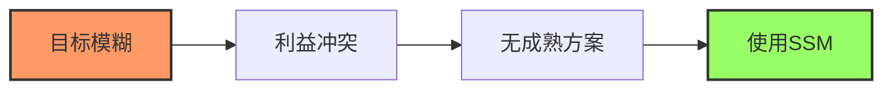
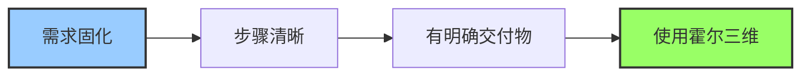
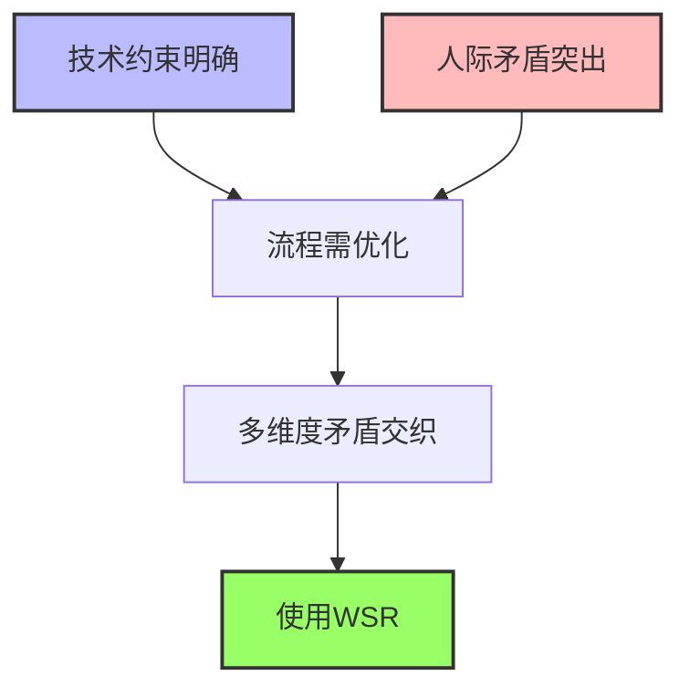
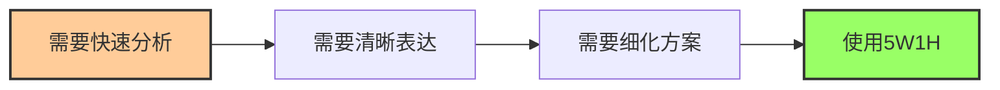

# 系统工程方法论运用时机

> [!abstract] 精准定位
> 这里为你精准界定**SSM、霍尔三维模型、WSR、5W1H**的核心运用时机与选型逻辑，附组合应用建议，方便直接落地。
>
> [[方法论和工程技术综合集成案例]]

---

## 核心方法论定位

> [!info] 四大方法论对比
>
> | 方法 | 全称 | 核心定位 | 典型特征 |
> |:---:|:-----|:---------|:---------|
| **SSM** | 软系统方法论 | 结构不良、目标模糊、多方利益冲突的软问题 | 多元视角、学习迭代、共识构建 |
> | **霍尔三维** | 霍尔三维结构模型 | 结构良好、目标明确、技术路径清晰的硬系统/工程项目 | 线性结构化阶段管控 |
> | **WSR** | 物理-事理-人理方法论 | 技术+人文复合的复杂系统问题 | 三维协同、整体最优与落地共识 |
> | **5W1H** | 六何分析法 | 通用结构化分析工具 | 六维度全面拆解、适配全场景 |

---

## 核心运用时机与典型场景

### SSM（软系统方法论）

> [!tip] 核心时机
> **项目前期 · 问题定义/共识构建阶段**
>
> 触发条件：无统一问题定义、情绪化对抗、利益诉求差异大

[[软系统方法论]]

| 维度 | 内容 |
|:---:|:-----|
| **典型场景** | 社区治理（加装电梯、垃圾分类）、组织变革（部门重组、跨部门协作）、公共服务优化（医疗资源分配）、创新项目前期（新产品需求探索） |
| **关键触发点** | 目标模糊、边界不清、多方对立、无成熟方案 |
| **核心价值** | 构建共识、明确问题定义、化解对立情绪 |



---

### 霍尔三维模型

> [!tip] 核心时机
> **项目中期 · 方案执行/阶段管控阶段**
>
> 触发条件：目标量化、技术方案确定、需分阶段验收、预算固定

[[霍尔三维结构]]

| 维度 | 内容 |
|:---:|:-----|
| **典型场景** | 大型基建工程（桥梁、水利、轨道交通）、IT系统实施（ERP、工业软件）、标准化生产/流程再造（生产线升级） |
| **关键触发点** | 需求固化、步骤清晰、有明确交付物、需严格进度/成本/质量管控 |
| **核心价值** | 保障按时按质交付、阶段管控、风险控制 |



---

### WSR（物理-事理-人理）

> [!tip] 核心时机
> **项目全生命周期 · 尤其方案设计+协调实施阶段**
>
> 触发条件：物理约束明确、事理流程需优化、人理矛盾突出，三者相互影响

[[物理-事理-人理方法论（WSR）]]

| 维度 | 内容 |
|:---:|:-----|
| **典型场景** | 智慧城市（充电桩、智慧社区）、大型工程项目管理（新能源电站、机场建设）、企业数字化转型（制造业升级）、公共危机治理（疫情防控） |
| **关键触发点** | 技术与人文并重、需兼顾可行性与合意性、多维度矛盾交织 |
| **核心价值** | 三维协同、整体最优、降低落地阻力 |



---

### 5W1H（六何分析法）

> [!tip] 核心时机
> **全场景 · 快速分析/方案细化/沟通汇报阶段**
>
> 触发条件：需要厘清逻辑、明确边界、落地执行的环节

[[5W1H方法]]

| 维度 | 内容 |
|:---:|:-----|
| **典型场景** | 问题诊断（生产异常、客户投诉）、计划制定（活动策划、学习计划）、流程优化（工作/服务/生产流程）、沟通汇报（会议议程、项目汇报） |
| **关键触发点** | 需要快速拆解问题、梳理方案、清晰表达 |
| **核心价值** | 快速分析、逻辑清晰、落地可执行，适配其他方法论的细化落地 |



---

## 选型与组合应用建议

### 单一选型决策树

> [!success] 快速选型指南
>
> ```mermaid
> graph TD
>     A[开始] --> B{问题类型}
>     B -->|软问题/共识缺失| C[SSM]
>     B -->|硬项目/执行管控| D[霍尔三维]
>     B -->|技术+人文复合| E[WSR]
>     B -->|快速分析/细化| F[5W1H]
>
>     C --> G{需要细化?}
>     D --> G
>     E --> G
>     G -->|是| F
>     G -->|否| H[执行]
>
>     style A fill:#fff,stroke:#333,stroke-width:2px
>     style F fill:#9f6,stroke:#333,stroke-width:2px
> ```

| 场景特征 | 推荐方法 |
|:--------:|:---------|
| 纯软问题、共识缺失 | SSM |
| 纯硬项目、执行管控 | 霍尔三维模型 |
| 技术+人文复合、三维协同 | WSR |
| 快速拆解、细化方案、沟通汇报 | 5W1H |

---

### 组合应用（复杂项目最优解）

> [!tip] 标准组合流程
>
> ```mermaid
> graph LR
>     A[SSM<br>前期共识] --> B[WSR<br>三维方案设计]
>     B --> C[5W1H<br>细化执行]
>     C --> D[霍尔三维<br>分阶段管控]
>
>     style A fill:#f96,stroke:#333,stroke-width:2px
>     style B fill:#bbf,stroke:#333,stroke-width:2px
>     style C fill:#fc9,stroke:#333,stroke-width:2px
>     style D fill:#9f6,stroke:#333,stroke-width:2px
> ```

#### 组合案例

| 项目类型 | 组合路径 | 说明 |
|:--------:|:---------|:-----|
| **老旧小区充电桩项目** | SSM → WSR → 5W1H → 霍尔三维 | 前期共识 → 三维方案设计 → 细化执行 → 分阶段管控 |
| **企业数字化转型** | SSM → WSR → 5W1H → 霍尔三维 | 诉求共识 → 技术+流程+组织协同 → 细化计划 → 实施验收 |
| **智慧城市建设** | WSR → 5W1H → 霍尔三维 | 三维协同 → 细化执行 → 标准化管控 |

---

### 切换时机

> [!info] 方法切换信号
>
> | 切换 | 触发信号 |
> |:---:|:---------|
| **SSM → WSR** | 达成初步共识后，进入三维方案设计 |
> **WSR → 5W1H** | 方案框架确定后，细化执行步骤与权责 |
| **5W1H → 霍尔三维** | 执行计划固化后，进入标准化阶段管控 |

---

## 方法论特征对比表

> [!summary] 特征对比
>
> | 维度 | SSM | 霍尔三维 | WSR | 5W1H |
> |:---:|:----|:--------|:---|:-----|
| **问题类型** | 结构不良、软问题 | 结构良好、硬系统 | 技术+人文复合 | 通用 |
> | **核心目标** | 学习与共识构建 | 按时按质交付 | 三维协同整体最优 | 逻辑清晰可执行 |
> | **适用阶段** | 项目前期 | 项目中期 | 全生命周期 | 全阶段 |
| | 问题定义 | 方案执行 | 方案设计+实施 | 快速分析 |
| **思维特点** | 多元主观、迭代学习 | 线性客观、结构化 | 三维协同、折衷平衡 | 六维拆解、全面覆盖 |
| **产出物** | 共识、问题定义 | 交付物、验收报告 | 三维协同方案 | 分析报告、执行计划 |

---

## 快速决策流程

> [!checklist] 选型检查清单
>
> 1. **问题是什么类型？**
>    - [ ] 软问题（多方利益、目标模糊）→ SSM
>    - [ ] 硬项目（技术清晰、目标明确）→ 霍尔三维
>    - [ ] 复合问题（技术+人文）→ WSR
>
> 2. **项目处于什么阶段？**
>    - [ ] 前期问题定义 → SSM
>    - [ ] 方案设计阶段 → WSR
>    - [ ] 执行管控阶段 → 霍尔三维
>
> 3. **需要快速分析/细化吗？**
>    - [ ] 是 → 叠加 5W1H

---

## 相关文档

- [[软系统方法论]] - SSM详解
- [[霍尔三维结构]] - 霍尔三维详解
- [[物理-事理-人理方法论（WSR）]] - WSR详解
- [[5W1H方法]] - 5W1H详解
- [[软系统方法案例分析]] - SSM案例
- [[WSR案例分析]] - WSR案例
- [[方法论和工程技术综合集成案例]] - 综合应用案例
- [[系统工程原理]] - 返回主目录

---

%%%
文档维护记录：
- 2024-01-15：初始创建
- 2024-01-20：添加Obsidian格式优化和Mermaid图表
%%%
