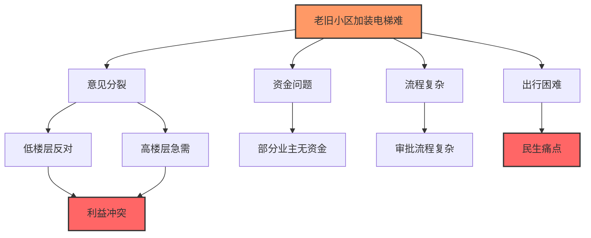
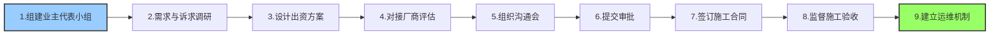

# 软系统方法论案例分析：老旧小区加装电梯

> [!abstract] 案例背景
> **场景**：社区老旧小区无电梯加装难
>
> **特点**：典型软问题，多方利益、目标模糊、约束多
>
> **严格遵循**：SSM七步法 + 核心工具

---

## 项目前提

> [!warning] 问题情境
>
> | 维度 | 现状描述 |
> |:---:|:---------|
| **小区情况** | 30年房龄，6层无电梯，老人小孩出行难 |
| **核心问题** | 业主意见分裂，加装电梯推进停滞 |
| **利益冲突** | 低楼层不愿出钱/怕噪音，高楼层急需，部分业主无资金 |
| **权限困境** | 物业无权限主导，住建有补贴但流程复杂 |



---

## 一、七步法完整执行过程

### 步骤1：进入问题情境 —— 绘制丰富图

> [!tip] 丰富图（Rich Picture）
> 用图形化方式描绘问题场的全貌

| 要素 | 具体内容 |
|:---:|:---------|
| **利益相关者** | 高楼层业主（刚需）、低楼层业主（反对/观望）、物业、社区居委会、住建部门、电梯厂商、施工队 |
| **核心矛盾** | 出资分摊、施工噪音/采光影响、审批流程、资金缺口 |
| **约束** | 楼栋结构限制、预算、政策红线、业主投票门槛 |

---

### 步骤2：表达问题情境

> [!info] 共识表述
>
> **问题定义**：
>
> 老旧小区业主加装电梯的需求与业主意见分歧、资金约束、审批流程复杂、施工影响之间的矛盾，导致电梯加装推进停滞。

---

### 步骤3：相关系统的根定义（CATWOE）

> [!tip] CATWOE根定义
> 一句话定义系统核心，覆盖六要素

| 要素 | 内容 |
|:---:|:-----|
| **C（顾客）** | 小区全体业主（尤其老人、行动不便者） |
| **A（执行者）** | 业主代表小组 + 居委会 + 物业 + 电梯厂商 |
| **T（转变过程）** | 从"无电梯、业主分歧大"到"电梯建成投用、业主共识达成" |
| **W（世界观）** | 老旧小区适老化改造是民生刚需，兼顾各方利益才能推进 |
| **O（所有者）** | 业主委员会（代表全体业主） |
| **E（环境约束）** | 住建补贴政策、楼栋结构安全标准、业主投票比例（双三分之二）、预算上限 |

> [!success] 根定义
>
> 一个由业主代表小组牵头，联合居委会、物业和电梯厂商，在住建政策与安全标准约束下，通过共识搭建、资金统筹、合规审批、施工管控，满足业主加装电梯需求并减少邻里矛盾的民生改善系统。

---

### 步骤4：构建概念模型（核心活动序列）

> [!tip] 概念模型
> 描述系统"应该做什么"的理想模型



| 序号 | 核心活动 |
|:---:|:---------|
| 1 | 组建业主代表小组（覆盖各楼层） |
| 2 | 开展业主需求与诉求调研 |
| 3 | 设计多元出资分摊方案（含补贴申请） |
| 4 | 对接电梯厂商，完成方案与安全评估 |
| 5 | 组织业主沟通会，达成共识并投票 |
| 6 | 提交住建部门审批，申请补贴 |
| 7 | 签订合同，监督施工，控制噪音/采光影响 |
| 8 | 验收投用，建立电梯运维机制 |

---

### 步骤5：比较模型与现实（找差距）

> [!warning] 差距分析
>
> | 概念模型活动 | 现实差距 |
> |:-----------|:---------|
| 业主代表小组 | 无正式小组，高/低楼层对立 |
| 出资方案 | 无多元方案，低楼层拒绝出资 |
| 沟通共识 | 无有效沟通渠道，情绪化对抗 |
| 审批补贴 | 无人牵头对接，不清楚政策流程 |
| 施工管控 | 无监督机制，担心噪音、安全隐患 |

---

### 步骤6：可行的系统变革（小步快跑，不求最优）

> [!success] 变革方案
>
> | 序号 | 变革措施 |
> |:---:|:---------|
| 1 | 居委会牵头，成立业主代表小组（每楼层1名） |
| 2 | 邀请住建专家宣讲补贴政策，设计"梯度出资+补贴+分期"方案 |
| 3 | 组织多轮沟通会，用沙盘模拟施工影响，给出降噪、采光优化措施 |
| 4 | 由代表小组牵头，准备材料，对接住建部门，统一办理审批和补贴 |
| 5 | 选定口碑厂商，签订明确施工标准与赔偿条款的合同 |
| 6 | 设立施工监督岗（业主代表轮值），定期公示进度 |

---

### 步骤7：实施与评估（迭代循环）

> [!tip] 实施与评估
>
> ```mermaid
> graph LR
>     A[执行] --> B[评估]
>     B --> C[迭代]
>     C --> A
>
>     A --> A1[完成小组组建]
>     A --> A2[方案共识]
>     A --> A3[审批施工]
>     A --> A4[验收]
>
>     B --> B1[满意度调查]
>     B --> B2[收集运维问题]
>
>     C --> C1[总结经验]
>     C --> C2[形成模板]
>     C --> C3[进入下一轮SSM]
>
>     style A fill:#9cf,stroke:#333,stroke-width:2px
>     style C fill:#fc9,stroke:#333,stroke-width:2px
> ```
>
> - **执行**：按变革方案推进，完成小组组建、方案共识、审批、施工、验收
> - **评估**：投用后满意度调查，收集运维问题
> - **迭代**：针对运维成本分摊、电梯保养等新问题，重新进入SSM流程

---

## 二、关键工具落地示例

### 丰富图

> [!example] 丰富图要素
>
> - 手绘包含业主群体、居委会、住建部门、电梯厂商的关系图
> - 标注"出资分歧""审批难""施工影响"等矛盾点
> - 用不同颜色区分不同利益相关者的立场

---

### CATWOE根定义

> [!example] CATWOE填写示例
>
> 前面已完整给出，一句话锁定系统核心

---

### 概念模型

> [!example] 活动图绘制
>
> - 用活动图画出8个核心活动的先后顺序
> - 明确每个活动的输出
> - 标注关键决策点

---

### 比较辩论

> [!example] 辩论组织
>
> - 组织业主代表对照模型与现实
> - 讨论"为什么没有代表小组""出资方案缺什么"等问题
> - 鼓励不同观点表达，促进学习

---

## 三、SSM核心价值体现

> [!success] 三大核心价值
>
> ```mermaid
> graph TD
>     A[SSM核心价值] --> B[问题重构]
>     A --> C[组织学习]
>     A --> D[可行合意]
>
>     B --> B1[从技术问题转为软问题]
>     B --> B2[利益共识+流程落地]
>
>     C --> C1[从对立到协作]
>     C --> C2[共同理解提升]
>
>     D --> D1[可行但不一定最优]
>     D --> D2[降低落地阻力]
>
>     style A fill:#f9f,stroke:#333,stroke-width:2px
> ```
>
> | 价值 | 说明 |
> |:---:|:-----|
> **问题重构** | 从"电梯加装"的技术问题，转为"利益共识+流程落地"的软问题 |
> **组织学习** | 过程中促进业主从对立到协作，实现组织学习 |
> **可行合意** | 方案是可行、合意的，而非理论最优，降低落地阻力 |

---

## 四、案例启示

> [!tip] SSM方法论关键要点
>
> 1. **问题定义比解决方案更重要**：SSM的核心是帮助利益相关者达成对问题的共同理解
>
> 2. **多元视角必须被尊重**：不同利益相关者的观点都有合理性，需要通过对话达成共识
>
> 3. **变革是小步快跑**：不求一次性解决所有问题，通过渐进式改善逐步推进
>
> 4. **学习是核心目标**：SSM的价值不仅在于解决方案，更在于过程中的组织学习

---

## 五、SSM实施检查清单

> [!checklist] 七步法检查清单
>
> - [ ] **步骤1**：是否绘制了包含所有利益相关者的丰富图？
> - [ ] **步骤2**：是否形成了对问题情境的共识表述？
> - [ ] **步骤3**：是否用CATWOE完成了根定义？
> - [ ] **步骤4**：是否构建了包含核心活动的概念模型？
> - [ ] **步骤5**：是否比较了模型与现实的差距？
> - [ ] **步骤6**：是否设计了可行、合意的变革方案？
> - [ ] **步骤7**：是否实施了方案并进行了评估？

---

## 相关文档

- [[软系统方法论]] - SSM方法论详解
- [[系统工程方法论运用时机]] - 何时使用SSM
- [[物理-事理-人理方法论（WSR）]] - 与SSM配合使用
- [[系统工程原理]] - 返回主目录

---

%%%
文档维护记录：
- 2024-01-15：初始创建
- 2024-01-20：添加Obsidian格式优化和Mermaid图表
%%%
