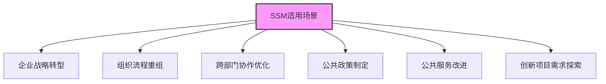

# 软系统方法论（SSM）

> [!abstract] 方法概述
> **软系统方法论（Soft Systems Methodology, SSM）** 是英国学者 Peter Checkland 提出的定性、行动导向方法
>
> 核心是用系统思维处理复杂、模糊、结构不良的"棘手问题"（Wicked Problems）
>
> 强调多元视角与学习迭代，聚焦人类活动系统的整体性改善

[[软系统方法案例分析]]

---

## 一、核心定位与核心理念

### 适用场景

> [!info] 软问题特征
>
> | 特征 | 说明 | 示例 |
> |:---:|:-----|:-----|
| **无明确边界** | 问题边界模糊，难以界定 | 组织变革应该从哪里开始？ |
| **目标模糊** | 多方对目标有不同理解 | "提升组织效率"具体指什么？ |
| **多方利益冲突** | 利益相关者诉求差异大 | 装修电梯：高楼层需要，低楼层反对 |
| **含社会人文因素** | 涉及价值观、文化、权力 | 社区治理涉及多方利益 |

**典型场景**：
- 组织变革、部门重组、跨部门协作
- 公共服务优化、医疗资源分配
- 创新项目前期需求探索
- 社区治理、公共政策制定

---

### 核心理念

> [!tip] 四大核心理念
>
> ```mermaid
> graph TD
>     A[SSM核心理念] --> B[多元建构]
>     A --> C[学习导向]
>     A --> D[系统整体观]
>     A --> E[行动反思]
>
>     B --> B1[问题是主观认知产物]
>     B --> B2[无唯一正确视角]
>
>     C --> C1[过程重于方案]
>     C --> C2[促进共同理解]
>
>     D --> D1[人类活动系统]
>     D --> D2[要素关联与整体效能]
>
>     E --> E1[反思与行动结合]
>     E --> E2[迭代循环推进]
>
>     style A fill:#f9f,stroke:#333,stroke-width:2px
>     style C fill:#9cf,stroke:#333,stroke-width:2px
> ```
>
> | 理念 | 说明 |
> |:---:|:-----|
| **多元建构** | 问题是主观认知与社会互动的产物，不存在唯一"正确"视角 |
| **学习导向** | 过程重于方案，优先促进共同理解与组织学习 |
| **系统整体观** | 将情境视为"人类活动系统"，强调要素关联与整体效能 |
| **行动反思** | 反思与行动结合，迭代循环推进问题改善 |

---

### 关键工具

| 工具 | 用途 |
|:---:|:-----|
| **丰富图（Rich Pictures）** | 可视化描绘问题场的人、事、关系、矛盾 |
| **CATWOE根定义** | 一句话定义系统核心，确保完整性 |
| **概念模型** | 描述系统"应该做什么"的理想模型 |
| **比较与辩论** | 对照模型与现实，引发学习 |
| **可行变革** | 设计可行、合意的改善行动 |

---

## 二、经典七步流程（迭代循环）

> [!tip] SSM七步法
>
> ```mermaid
> graph LR
>     A[1.进入问题情境] --> B[2.表达问题情境]
>     B --> C[3.根定义CATWOE]
>     C --> D[4.构建概念模型]
>     D --> E[5.比较模型与现实]
>     E --> F[6.可行的系统变革]
>     F --> G[7.实施与评估]
>     G --> A
>
>     style A fill:#f96,stroke:#333,stroke-width:2px
>     style C fill:#9cf,stroke:#333,stroke-width:2px
>     style E fill:#fc9,stroke:#333,stroke-width:2px
>     style G fill:#9f6,stroke:#333,stroke-width:2px
> ```

### 步骤1：进入问题情境 —— 用丰富图描绘

> [!info] 丰富图（Rich Pictures）
>
> **目的**：可视化呈现"问题场"的全貌
>
> **包含要素**：
> - 利益相关者（人/组织）
> - 权力关系、沟通渠道
> - 矛盾、约束、边界
> - 情感、价值观、文化
>
> **绘制要点**：
> - 手绘或数字化均可
> - 不拘泥于形式，自由表达
> - 用符号、颜色、线条增强表达

---

### 步骤2：表达问题情境

> [!info] 问题表述
>
> **目的**：梳理关键议题、冲突与不确定性
>
> **产出**：初步共识的问题表述
>
> **关键问题**：
> - 核心矛盾是什么？
> - 各方诉求是什么？
> - 约束条件有哪些？

---

### 步骤3：相关系统的根定义（CATWOE）

> [!info] CATWOE根定义
>
> **目的**：一句话定义系统核心，确保完整性
>
> | 要素 | 含义 | 问题 |
> |:---:|:-----|:-----|
| **C** 顾客（Customers） | 系统的受益者或受害者 | 谁受益？谁受损？ |
| **A** 执行者（Actors） | 执行系统活动的人 | 谁来执行？ |
| **T** 转变过程（Transformation） | 系统实现的转变 | 从什么变成什么？ |
| **W** 世界观（Weltanschauung） | 系统背后的信念/价值观 | 为什么这个系统重要？ |
| **O** 所有者（Owners） | 拥有系统决策权的人 | 谁有权停止系统？ |
| **E** 环境约束（Environmental） | 系统外部约束 | 有哪些限制？ |

> [!success] 根定义示例
>
> 一个由业主代表小组牵头，联合居委会、物业和电梯厂商，在住建政策与安全标准约束下，通过共识搭建、资金统筹、合规审批、施工管控，满足业主加装电梯需求并减少邻里矛盾的民生改善系统。

---

### 步骤4：构建概念模型

> [!info] 概念模型
>
> **目的**：按根定义描述系统"应该做什么"
>
> **原则**：
> - 只考虑必要活动，不考虑现实限制
> - 聚焦目标与逻辑顺序
> - 排除冗余与干扰
>
> **工具**：IDEF0、活动图、流程图

---

### 步骤5：比较模型与现实

> [!warning] 比较与辩论
>
> **目的**：对照概念模型与现实，找差距、探成因
>
> **方法**：
> - 组织利益相关者对照讨论
> - 识别现实与模型的差距
> - 挖掘隐性假设
> - 引发辩论与学习

---

### 步骤6：可行的系统变革

> [!success] 变革设计
>
> **目的**：提出可行、合意、能落地的改善行动
>
> **原则**：
> - 不求"最优"，但求"更好"
> - 小步快跑，渐进改善
> - 可验证、可调整

---

### 步骤7：实施与评估

> [!tip] 实施与评估
>
> **目的**：执行方案并监控，根据反馈调整
>
> **产出**：
> - 改善的系统状态
> - 组织学习成果
> - 下一轮迭代的输入

---

## 三、与硬系统方法论的区别

> [!summary] 软硬系统对比
>
> | 维度 | 软系统方法论 SSM | 硬系统方法论 |
> |:---:|:----------------|:-------------|
> | **问题类型** | 结构不良、目标模糊 | 结构良好、目标明确 |
> | **核心目标** | 学习与改善 | 优化与求最优解 |
> | **解决方案** | 可行、合意、迭代 | 最优、技术驱动 |
> | **视角** | 多元主观、整体观 | 单一客观、还原论 |
> | **适用领域** | 社会、管理、组织 | 工程、技术、物理系统 |
> | **思维方式** | 系统思维 | 还原思维 |

---

## 四、应用要点

### 准备阶段

> [!checklist] 准备清单
>
> - [ ] 明确问题情境，识别关键利益相关者
> - [ ] 建立开放沟通机制
> - [ ] 确保各方都有表达机会

### 执行阶段

> [!checklist] 执行要点
>
> - [ ] 用丰富图与CATWOE确保问题界定全面
> - [ ] 概念模型要简洁可沟通
> - [ ] 比较阶段鼓励辩论
> - [ ] 变革方案要小步快跑、可验证

### 迭代阶段

> [!checklist] 迭代要点
>
> - [ ] 评估结果，更新问题认知
> - [ ] 调整模型与行动
> - [ ] 循环优化，持续改善

---

## 五、典型应用场景



| 场景类型 | 具体应用 |
|:--------:|:---------|
| **企业管理** | 战略转型、流程重组、跨部门协作优化 |
| **公共服务** | 医疗/教育等公共服务改进、资源配置优化 |
| **公共政策** | 政策制定、社会问题治理、城市规划 |
| **IT项目** | 复杂IT项目需求探索、多方合作创新项目 |

---

## 六、快速记忆口诀

> [!tip] 记忆口诀
>
> **情表根模比变行**
>
> 情境 → 表达 → 根定义 → 模型 → 比较 → 变革 → 行动
>
> **循环迭代促学习**

---

## 七、SSM与其他方法论的关系

> [!info] 方法论配合
>
> | 方法论 | 与SSM关系 |
> |:------:|:---------|
> | [[物理-事理-人理方法论（WSR）]] | SSM是WSR中人理维的重要工具 |
> | [[5W1H方法]] | 5W1H可用于细化SSM中的利益相关者和行动节点 |
> | [[系统工程方法论运用时机]] | 了解何时使用SSM |

---

## 相关文档

- [[软系统方法案例分析]] - 老旧小区加装电梯案例
- [[物理-事理-人理方法论（WSR）]] - 与SSM配合使用
- [[系统工程方法论运用时机]] - 何时使用SSM
- [[系统工程原理]] - 返回主目录

---

%%%
文档维护记录：
- 2024-01-15：初始创建
- 2024-01-20：添加Obsidian格式优化和Mermaid图表
%%%
