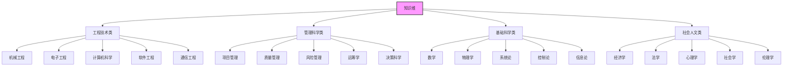
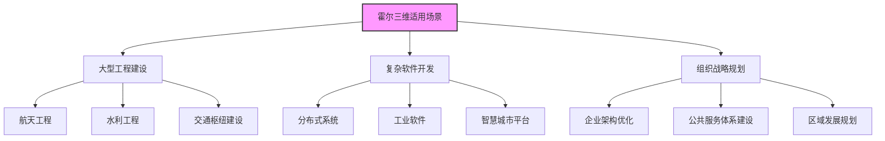

# 霍尔三维结构

> [!abstract] 方法概述
> **霍尔三维结构** 是美国系统工程专家 A.D. Hall 于 1969 年提出的系统工程方法论框架
>
> 核心思想是通过**时间维、逻辑维、知识维**的三维一体、交叉协同，确保系统工程活动的有序性、完整性和科学性

[[建立系统模型]] | [[系统分析]]

---

## 概述

> [!info] 三维核心构成
>
> ```mermaid
> graph TD
>     A[霍尔三维结构] --> B[时间维]
>     A --> C[逻辑维]
>     A --> D[知识维]
>
>     B --> B1[系统生命周期]
>     B --> B2[7个阶段]
>
>     C --> C1[解决问题步骤]
>     C --> C2[7个步骤]
>
>     D --> D1[支撑学科知识]
>     D --> D2[跨学科知识体系]
>
>     style A fill:#f9f,stroke:#333,stroke-width:2px
>     style B fill:#bbf,stroke:#333,stroke-width:2px
>     style C fill:#bfb,stroke:#333,stroke-width:2px
>     style D fill:#fbb,stroke:#333,stroke-width:2px
> ```
>
> | 维度 | 英文 | 含义 |
> |:---:|:-----|:-----|
| **时间维** | Time Dimension | 系统从诞生到退役的全生命周期阶段 |
| **逻辑维** | Logic Dimension | 每个时间阶段内解决问题的思维步骤 |
| **知识维** | Knowledge Dimension | 支撑系统工程实施的跨学科知识体系 |

> [!tip] 核心思想
>
> **时间维 × 逻辑维 = 工程管理矩阵**
>
> 三维一体、交叉协同，确保系统工程活动的有序性、完整性和科学性

---

## 一、时间维（Time Dimension）

> [!info] 时间维定义
> 系统从诞生到退役的全生命周期阶段，共7个阶段，按时间顺序推进

### 7个阶段详解


| 阶段 | 任务 | 产出物 |
|:---:|:-----|:-------|
| **1. 规划阶段** | 明确需求、目标，提出初步构想，开展可行性分析方向研判 | 项目建议书、可行性研究大纲 |
| **2. 拟定方案阶段** | 基于规划目标，调研设计多套备选技术方案与实施路线 | 备选方案集、方案对比清单 |
| **3. 研制阶段** | 方案选型后，开展详细设计、子系统研发、部件试制与集成 | 详细设计文档、原型系统、子系统产品 |
| **4. 生产阶段** | 批量生产（或软件部署），制定生产/部署规范 | 最终产品、生产工艺流程、部署手册 |
| **5. 安装阶段** | 现场安装、调试、软硬件适配，验证设计指标达成度 | 安装调试报告、运行环境确认单 |
| **6. 运行阶段** | 系统投入使用，监控运行状态，收集用户反馈 | 运行日志、用户使用报告、性能监测数据 |
| **7. 更新阶段** | 根据反馈与环境变化，升级维护或评估退役重建 | 系统更新方案、退役处置报告 |

---

## 二、逻辑维（Logic Dimension）

> [!info] 逻辑维定义
> 每个时间阶段内，需遵循的7个逻辑思维步骤，是系统工程的核心方法论流程

### 7个步骤详解


| 步骤 | 核心 | 说明 | 常用工具 |
|:---:|:-----|:-----|:---------|
| **1. 明确问题** | 界定问题边界、梳理成因，锚定核心诉求 | 问题树分析、5W2H法 | 问题树、5W2H |
| **2. 系统指标设计** | 将需求转化为可量化、可验证的系统指标 | QFD质量功能展开、SMART原则 | #量化指标 QFD、SMART |
| **3. 系统方案综合** | 基于指标发散设计多套方案，不局限单一思路 | 头脑风暴、TRIZ创新理论 | 头脑风暴、TRIZ |
| **4. 系统分析** | 对备选方案建模、仿真、计算，分析可行性与风险 | 系统动力学建模、有限元分析、成本效益分析 | 系统动力学、有限元分析 |
| **5. 系统方案优化** | 参数与结构优化，找到最优解/满意解 | 遗传算法、多目标优化模型、敏感性分析 | 遗传算法、多目标优化 |
| **6. 系统决策** | 综合技术、经济、社会因素，选定最终方案 | 层次分析法（AHP）、德尔菲法、决策矩阵 | AHP、德尔菲法 |
| **7. 实施计划** | 分解任务，明确时间节点、责任主体、资源配置 | 甘特图、WBS工作分解结构、PERT网络 | 甘特图、WBS、PERT |

---

## 三、知识维（Knowledge Dimension）

> [!info] 知识维定义
> 支撑系统工程实施的跨学科知识体系，渗透于时间维与逻辑维的所有活动

### 知识分类



| 类别 | 具体学科 |
|:---:|:---------|
| **工程技术类** | 机械工程、电子工程、计算机科学、软件工程、通信工程 |
| **管理科学类** | 项目管理、质量管理、风险管理、运筹学、决策科学 |
| **基础科学类** | 数学（概率统计/线性代数）、物理学、系统论、控制论、信息论 |
| **社会人文类** | 经济学、法学、心理学、社会学、伦理学 |

---

## 四、三维应用关系

> [!tip] 三维交叉协同
>
> ```mermaid
> graph TD
>     A[三维协同] --> B[时空交叉]
>     A --> C[知识支撑]
>     A --> D[核心价值]
>
>     B --> B1[时间维的每个阶段]
>     B --> B2[需完整执行逻辑维的7个步骤]
>     B --> B3[形成'阶段-步骤'二维活动矩阵]
>
>     C --> C1[知识维的各类知识]
>     C --> C2[按需匹配到'阶段-步骤'的具体活动中]
>
>     D --> D1[避免'重技术轻流程']
>     D --> D2[避免'重局部轻全局']
>     D --> D3[保障复杂系统工程的有序推进与整体最优]
>
>     style A fill:#f9f,stroke:#333,stroke-width:2px
> ```
>
> | 关系 | 说明 |
> |:---:|:-----|
| **时空交叉** | 时间维的每个阶段，都需完整执行逻辑维的7个步骤，形成「阶段-步骤」二维活动矩阵 |
| **知识支撑** | 知识维的各类知识，按需匹配到「阶段-步骤」的具体活动中 |
| **核心价值** | 避免「重技术轻流程」「重局部轻全局」，保障复杂系统工程的有序推进与整体最优 |

---

## 五、适用场景



| 场景类型 | 具体应用 |
|:--------:|:---------|
| **大型工程建设** | 航天工程、水利工程、交通枢纽建设 |
| **复杂软件开发** | 分布式系统、工业软件、智慧城市平台 |
| **组织与战略规划** | 企业架构优化、公共服务体系建设、区域发展规划 |

---

## 六、霍尔三维结构的应用要点

> [!warning] 应用注意
>
> 1. **阶段不能跳跃**：时间维的7个阶段必须按顺序推进，不能跳过某个阶段
>
> 2. **步骤必须完整**：每个时间阶段都必须完整执行逻辑维的7个步骤
>
> 3. **知识要匹配**：根据具体活动的需要，选择合适的知识支撑
>
> 4. **迭代是常态**：在实际应用中，可能需要在阶段间和步骤间进行迭代

---

## 七、霍尔三维与其他方法论的关系

> [!info] 方法论配合
>
> | 方法论 | 与霍尔三维的关系 |
> |:------:|:----------------|
> | [[物理-事理-人理方法论（WSR）]] | 霍尔三维是WSR中事理维的重要工具 |
> | [[5W1H方法]] | 5W1H可用于明确霍尔三维中各步骤的具体内容 |
> | [[系统工程方法论运用时机]] | 了解何时使用霍尔三维 |

---

## 八、霍尔三维结构实施检查清单

> [!checklist] 实施检查清单
>
> ### 时间维检查
> - [ ] 是否明确了当前项目所处的生命周期阶段？
> - [ ] 是否按照7个阶段的顺序推进？
>
> ### 逻辑维检查
> - [ ] 是否在每个阶段都完整执行了7个逻辑步骤？
> - [ ] 每个步骤的产出物是否完整？
>
> ### 知识维检查
> - [ ] 是否识别了所需的跨学科知识？
> - [ ] 是否建立了跨学科团队？

---

## 相关文档

- [[建立系统模型]] - 逻辑维第4步的系统分析
- [[系统分析]] - 逻辑维第4步的详细内容
- [[系统工程方法论运用时机]] - 何时使用霍尔三维
- [[系统工程原理]] - 返回主目录

---

%%%
文档维护记录：
- 2024-01-15：初始创建
- 2024-01-20：添加Obsidian格式优化和Mermaid图表
%%%
