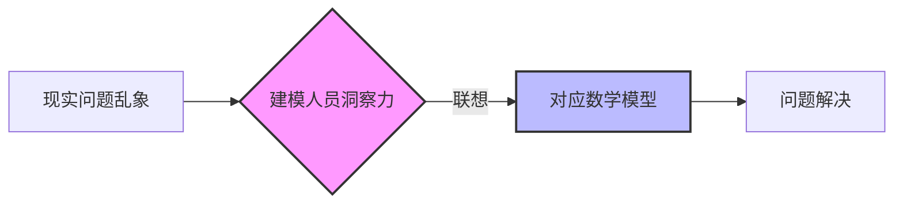
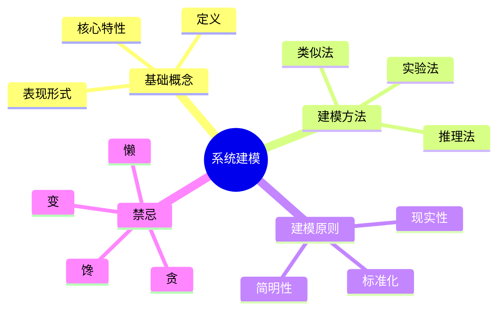

# 📘 系统建模 (System Modeling)

> [!abstract] 摘要
> 系统模型是对系统某一方面**本质属性**的描述。本文档系统性地介绍了系统建模的定义、必要性、分类、具体方法及原则，结合生动案例提供立体且独立的知识框架。

---

## 一、系统模型的基础概念

### 1. 定义与本质

> [!info] 核心定义
> **系统模型**是对系统某一方面**本质属性**的描述。

#### 表现形式

模型不一定是数学公式，也可以是：
- 文字描述
- 符号表示
- 图表展示
- 实物模型
- 计算机虚拟场景

#### 核心特性

| 特性 | 说明 |
|:---:|:-----|
| **抽象性** | 模型是现实系统的抽象和模仿，而非系统本身 |
| **本质性** | 只反映影响系统的主要因素，撇开非本质属性 |
| **关联性** | 集中体现主要因素之间的数量或逻辑关系 |

---

### 2. 建模的必要性

> [!question] 为什么要建模？
> 基于**同形性原理**：不同事物间存在相似规律，使得用模型代替实体进行分析成为可能。

#### 实践优势

> [!tip] 建模的核心价值
> - 💰 **经济性**：大型试验（如苏-30飞行、核试验）成本极高，模型仿真更经济
> - 🛡️ **安全性**：避免高危实验对人员和环境的风险
> - ⏱️ **时间性**：模型可重复使用，缩短研究周期
> - 🚀 **开发需求**：在系统尚未制造出来前（如新战机设计），模型是唯一的分析手段

---

## 二、系统建模的方法论

根据系统透明度（黑箱/白箱），建模分为以下四种主要方法：

### 建模方法对比表

|   方法    | 适用系统  | 特点          | 典型案例               |
| :-----: | :---- | :---------- | :----------------- |
| **推理法** | 白箱系统  | 内部机理清楚、定律明确 | [[5W1H方法\|生产计划安排]] |
| **实验法** | 黑箱系统  | 内部结构不清、机理不明 | 粮食生产预测             |
| **类似法** | 跨领域系统 | 数学形式相似      | 机械-电路模拟            |
|         |       |             |                    |

---

### 1. 推理法 (Deductive Method) —— 针对"白箱系统"

> [!note] 推理法
> **适用**：内部机理清楚、定律明确的系统
>
> **过程**：利用已知规律（如物理定律、经济定理）进行逻辑演绎

#### 案例：生产计划安排

- 已知产品 A、B 的资源消耗（煤、电、劳动力）和获利
- 通过推理建立**线性规划模型**
- 在资源约束下求解最大利润方案

$$
\begin{align}
\max \quad & Z = c_1x_1 + c_2x_2 \\
\text{s.t.} \quad & a_{11}x_1 + a_{12}x_2 \leq b_1 \\
& a_{21}x_1 + a_{22}x_2 \leq b_2 \\
& x_1, x_2 \geq 0
\end{align}
$$

---

### 2. 实验法与统计分析 (Experimental & Statistical Method) —— 针对"黑箱系统"

> [!note] 实验法与统计分析
> **适用**：内部结构不清、作用机理不明的复杂系统
>
> **过程**：通过测量输入输出数据，或利用历史统计年鉴数据进行辨识

#### 案例：粮食生产预测

- 由于无法直接实验，通过统计历年的数据：
  - 播种面积
  - 降雨量
  - 温度
  - 化肥量
- 建立多变量回归模型，找出各因素对产量的影响系数

$$
Y = \beta_0 + \beta_1X_1 + \beta_2X_2 + \beta_3X_3 + \beta_4X_4 + \varepsilon
$$

---

### 3. 类似法 (Analogous Method)

> [!note] 类似法
> **适用**：不同物理领域但在数学形式上相似的系统

#### 案例 A：机械与电路对应

| 机械系统 | 电路系统 | 对应关系 |
|:---------|:---------|:---------|
| 质量 $m$ | 电感 $L$ | 惯性 ↔ 惯性 |
| 位移 $x$ | 电荷 $q$ | 位置 ↔ 电量 |
| 速度 $v$ | 电流 $i$ | 变化率 ↔ 变化率 |
| 阻尼 $c$ | 电阻 $R$ | 耗散 ↔ 耗散 |

> [!tip] 应用
> 可以通过搭建电路系统来模拟复杂的机械振动过程

#### 案例 B：选址的物理实验

> [!example] 仓库选址的巧妙解法
> 将仓库选址问题通过滑轮、绳索和砝码重物建立物理模型。当重物达到力学平衡时，绳索交汇点即为最优坐标，巧妙避开了复杂的数学求解。

---

## 三、核心案例深度拆解：电冰箱市场模型

这是贯穿"模型特点"与"建模过程"的核心案例：

### 建模目标

分析电冰箱新旧更替规律以制定市场政策

### 主要假设

> [!warning] 模型简化假设
> - 引入 $\beta_i$ 表示使用了 $i$ 年后还能再用一年的概率
> - 设定最长寿命为 $n$ 年

### 模型形式

最终写成**状态空间模型**（矩阵形式）：

$$
\begin{bmatrix}
x_1(t+1) \\ x_2(t+1) \\ \vdots \\ x_n(t+1)
\end{bmatrix}
=
\begin{bmatrix}
\beta_1 & 0 & \cdots & 0 \\
1-\beta_1 & \beta_2 & \cdots & 0 \\
0 & 1-\beta_2 & \ddots & \vdots \\
0 & 0 & \cdots & \beta_n
\end{bmatrix}
\begin{bmatrix}
x_1(t) \\ x_2(t) \\ \vdots \\ x_n(t)
\end{bmatrix}
+
\begin{bmatrix}
s(t) \\ 0 \\ \vdots \\ 0
\end{bmatrix}
$$

### 关键启示

> [!important] 建模必须进行简化
> 在该模型中，以下细节被舍弃：
> - 品牌
> - 容量
> - 价格
>
> 只保留了"**年限**"与"**数量**"这一核心本质

---

## 四、建模的原则与禁忌

### 1. 三大基本要求

> [!success] 好模型的标准
>
> | 要求 | 说明 |
> |:---:|:-----|
> | **现实性** | 必须达到一定的精度，能反映客观实际 |
> | **简明性** | 满足精度前提下越简单越好，避免无谓的"数学游戏" |
> | **标准化** | 尽量向标准模型（如线性规划）靠拢，便于利用现成软件和算法求解 |

---

### 2. 建模人员的素质要求

| 素质 | 能力描述 |
|:---:|:---------|
| **洞察力** | 能从乱象中抓本质，如校门口交通混乱联想到排队论模型 |
| **想象力** | 能将现实问题与数学模型建立联系 |

---

### 3. 建模"四病"（必须避免）

> [!danger] 建模四大禁忌
>
> | 病症 | 表现 | 后果 |
> |:---:|:-----|:-----|
> | **懒** | 不深入调查，随意假设参数 | 模型脱离实际 |
> | **馋** | 盲目要求过量数据 | 淹没重点，效率低下 |
> | **贪** | 试图把所有细节都塞进模型 | 无法求解 |
> | **变** | 削足适履，篡改逻辑或数据适应固定模型 | 结果失真 |

---

## 五、与其他方法论的关联

> [!info] 相关方法论
> 系统建模是系统工程的重要环节，与其他方法论密切关联：
>
> - [[霍尔三维结构]] - 提供系统建模的整体框架
> - [[物理-事理-人理方法论（WSR）]] - 指导建模中的人因考虑
> - [[软系统方法论]] - 适用于软系统的建模思路
> - [[WSR案例分析]] - 展示建模方法的实际应用

---

## 六、总结

---

## 参考与延伸

- [[系统工程原理]] - 返回主目录
- [[系统工程方法论运用时机]] - 了解何时使用何种方法
