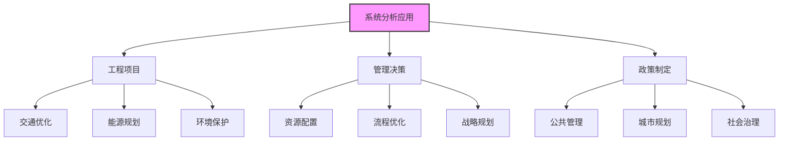

# 系统分析 (System Analysis)

> [!abstract] 核心定位
> **系统分析**是系统工程方法论中最关键的逻辑步骤
>
> 本质：一种**决策辅助技术**，通过对问题的定义、目标的识别和方案的评价，将复杂的决策过程转化为科学的、有数据支撑的分析结论
>
> 在技术研究层面，系统分析有时甚至被直接等同于系统工程

---

## 一、系统分析的定义与定位

> [!info] 核心地位
>
> ```mermaid
> graph LR
>     A[系统分析] --> B[决策辅助技术]
>     A --> C[系统工程核心步骤]
>     A --> D[谋划与评价]
>
>     B --> B1[问题定义]
>     B --> B2[目标识别]
>     B --> B3[方案评价]
>
>     C --> C1[逻辑维第4步]
>     C --> C2[建模分析]
>
>     D --> D1[方案优选]
>     D --> D2[科学决策]
>
>     style A fill:#f9f,stroke:#333,stroke-width:2px
> ```
>
> | 维度 | 说明 |
> |:---:|:-----|
| **核心地位** | 系统工程方法论中最关键的逻辑步骤 |
| **本质** | 决策辅助技术 |
> | **与系统工程关系** | 系统分析侧重"谋划"与"评价"（方案优选），系统工程还包括"实施"与"管理" |

---

## 二、创造性方案开发：从"杂乱"到"点子"

> [!tip] 方案开发的重要性
> 系统分析的第一步是打破常规，开发可行方案

### 1. 头脑风暴法 (Brainstorming)

> [!info] 头脑风暴法
>
> **本质**：一种旨在产生大量创造性设想的会议方法
>
> **三大铁律**：
>
> | 原则 | 说明 |
> |:---:|:-----|
> | **绝对自由** | 严禁任何禁忌或条条框框，鼓励怪异甚至荒唐的点子 |
> | **严禁批评** | 会议期间绝对禁止对他人提出的设想进行任何形式的评价或批评 |
> | **追求数量** | 打破心理障碍，先有"量"的突破，才有"质"的跃迁 |

---

### 2. 逻辑梳理工具

> [!summary] 常用工具
>
> | 工具 | 用途 | 说明 |
> |:---:|:-----|:-----|
> | **5W1H法** | 全方位解剖问题 | 从何人、何事、何时、何地、为何、如何六个维度分析 |
> | **因果关系图（鱼刺图）** | 层层剥茧找原因 | 通过图形化手段，找出导致系统现状的底层原因 |
> | **目的手段分析法** | 建立逻辑链条 | 不断追问"为了实现A，手段是什么"，建立从目标到行动的逻辑链条 |

---

## 三、系统分析的逻辑流程（要素结构）

> [!tip] 严密的逻辑循环
>
> ```mermaid
> graph LR
>     A[1.研究意图<br>明确问题] --> B[2.确定目标]
>     B --> C[3.开发可行方案]
>     C --> D[4.模型化分析]
>     D --> E[5.评价与排序]
>     E --> A
>
>     style A fill:#f96,stroke:#333,stroke-width:2px
>     style D fill:#9cf,stroke:#333,stroke-width:2px
>     style E fill:#9f6,stroke:#333,stroke-width:2px
> ```
>
> | 步骤 | 内容 | 关键产出 |
> |:---:|:-----|:---------|
| **1. 研究意图与明确问题** | 深入理解决策者（领导）的真实意图，定义系统的边界 | 问题定义文档 |
| **2. 确定目标** | 明确系统要达到的具体标准 | 目标体系 |
| **3. 开发可行方案** | 提出若干杂乱无章但具有潜力的替代方案 | 备选方案集 |
| **4. 模型化分析** | 利用模型测算各方案的**效果（产出）**与**代价（成本）** | 模型分析结果 |
| **5. 评价与排序** | 依据准则对原本零散的方案进行科学排序，得出最优建议 | 方案排序与推荐 |

---

## 四、系统分析的四大原则（实战守则）

> [!success] 四大平衡原则
>
> ```mermaid
> graph TD
>     A[系统分析原则] --> B[内外结合]
>     A --> C[局部与整体结合]
>     A --> D[当前与长远结合]
>     A --> E[定量与定性结合]
>
>     B --> B1[内部决策变量]
>     B --> B2[外部约束变量]
>
>     C --> C1[子系统优化]
>     C --> C2[大系统目标]
>
>     D --> D1[当前收益]
>     D --> D2[可持续性]
>
>     E --> E1[数据模型]
>     E --> E2[专家直觉]
>
>     style A fill:#f9f,stroke:#333,stroke-width:2px
> ```

### 1. 内部决策与外部约束（内外结合）

> [!tip] 内外结合
>
> | 变量类型 | 定义 | 示例 |
> |:--------|:-----|:-----|
> | **决策变量** | 内部可控因素 | 校门口红绿灯的配时 |
> | **约束变量** | 外部不可控因素 | 交通流量、天气、法律法规 |
>
> **关键**：分析时必须将两者结合

---

### 2. 局部优化与整体最优（局部与整体结合）

> [!tip] 局部与整体
>
> - 避免"头痛医头"
> - 子系统的优化必须服从于整个大系统的目标
>
> **示例**：优化某个部门的工作流程可能增加整个公司的成本

---

### 3. 当前收益与可持续性（当前与长远结合）

> [!tip] 当前与长远
>
> - 评价方案时，不能只看眼前的指标（如今年利润）
> - 要考虑整个生命周期的长远影响
>
> **示例**：削减研发投入可能提高短期利润，但损害长期竞争力

---

### 4. 数据模型与专家直觉（定量与定性结合）

> [!tip] 定量与定性
>
> - 系统分析强调定量模型
> - 但不能盲目迷信数字
> - 必须结合专家的经验判断和现实无法数字化的因素
>
> **示例**：员工士气、品牌声誉等难以量化的因素需要专家判断

---

## 五、系统分析的关键工具

| 工具类型 | 具体工具 | 用途 |
|:--------|:---------|:-----|
| **方案开发工具** | 头脑风暴、5W1H、鱼刺图、目的手段分析 | 产生和梳理方案 |
| **建模工具** | 系统动力学、有限元分析、成本效益分析 | 模型化分析 |
| **评价工具** | 层次分析法（AHP）、德尔菲法、决策矩阵 | 评价与排序 |
| **优化工具** | 遗传算法、多目标优化、敏感性分析 | 方案优化 |

---

## 六、系统分析的典型应用场景



| 场景类型 | 具体应用 |
|:--------:|:---------|
| **工程项目** | 交通优化、能源规划、环境保护 |
| **管理决策** | 资源配置、流程优化、战略规划 |
| **政策制定** | 公共管理、城市规划、社会治理 |

---

## 七、系统分析实施检查清单

> [!checklist] 实施检查清单
>
> ### 问题定义阶段
> - [ ] 是否理解了决策者的真实意图？
> - [ ] 是否明确界定了系统边界？
>
> ### 目标确定阶段
> - [ ] 目标是否具体、可衡量？
> - [ ] 是否考虑了多重目标？
>
> ### 方案开发阶段
> - [ ] 是否产生了足够多的备选方案？
> - [ ] 方案是否具有可行性？
>
> ### 模型分析阶段
> - [ ] 是否建立了合适的模型？
> - [ ] 是否测算效果与代价？
>
> ### 评价排序阶段
> - [ ] 是否建立了评价准则？
> - [ ] 是否考虑了定量与定性因素？
>
> ### 四大原则检查
> - [ ] 是否结合了内外部因素？
> - [ ] 是否考虑了整体最优？
> - [ ] 是否考虑了长远影响？
> - [ ] 是否结合了定量与定性分析？

---

## 八、系统分析与其他方法论的关系

> [!info] 方法论配合
>
> | 方法论 | 与系统分析的关系 |
> |:------:|:----------------|
> | [[霍尔三维结构]] | 系统分析是霍尔三维逻辑维的第4步 |
> | [[建立系统模型]] | 系统分析需要建立在系统模型的基础上 |
> | [[5W1H方法]] | 5W1H可用于明确问题和目标 |

---

## 相关文档

- [[建立系统模型]] - 系统建模是系统分析的基础
- [[霍尔三维结构]] - 系统分析是逻辑维的第4步
- [[系统工程原理]] - 返回主目录

---

%%%
文档维护记录：
- 2024-01-15：初始创建
- 2024-01-20：添加Obsidian格式优化和Mermaid图表
%%%
